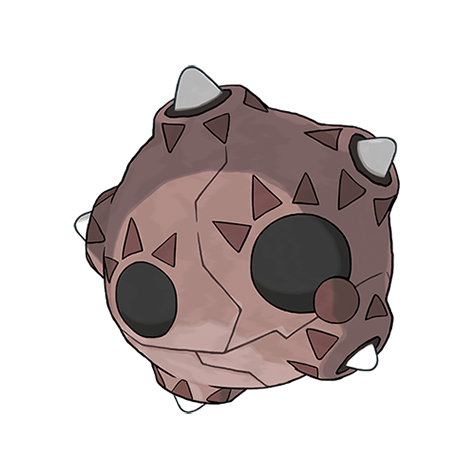

# Minior (#0774)

*Meteor Pokemon*

**Type:** Roccia / Volante
**Abilities:** [[Shields Down]]
**Base HP:** 4

> They live on the stratosphere, absorbing particles to grow their cores and shells, when they become too heavy they fall to the ground. Move damage can break the shell and leave the core exposed.

---

## Statistiche (Attributes & Limits)

| Attribute | Base / Limit |
|---|---|
| **Strength** | 2/4 |
| **Dexterity** | 2/4 |
| **Vitality** | 3/6 |
| **Special** | 2/4 |
| **Insight** | 3/6 |

---

## Mosse (Learnset)

- **Starter:** [[Tackle|Tackle]], [[Defense_Curl|Defense Curl]], [[Rollout|Rollout]]
- **Beginner:** [[Confuse_Ray|Confuse Ray]], [[Swift|Swift]], [[Ancient_Power|Ancient Power]]
- **Amateur:** [[Self_Destruct|Self Destruct]], [[Stealth_Rock|Stealth Rock]], [[Take_Down|Take Down]], [[Autotomize|Autotomize]], [[Cosmic_Power|Cosmic Power]], [[Power_Gem|Power Gem]]
- **Ace:** [[Double_Edge|Double-Edge]], [[Shell_Smash|Shell Smash]], [[Explosion|Explosion]]
- **Pro:** [[Light_Screen|Light Screen]], [[Reflect|Reflect]], [[Acrobatics|Acrobatics]]

---

## Correlati

### Catena Evolutiva
- [[0774_Minior|Minior]]
- Minior Core

---

## Minior (Forma Nucleo) (#0774F1)

**Type:** Roccia / Volante
**Abilities:** [[Shields Down]]
**Base HP:** 4

| Attribute | Base / Limit |
|---|---|
| **Strength** | 3/6 |
| **Dexterity** | 3/7 |
| **Vitality** | 2/4 |
| **Special** | 3/6 |
| **Insight** | 2/4 |

### Mosse

- **Starter:** [[Tackle|Tackle]], [[Defense_Curl|Defense Curl]], [[Rollout|Rollout]]
- **Beginner:** [[Confuse_Ray|Confuse Ray]], [[Swift|Swift]], [[Ancient_Power|Ancient Power]]
- **Amateur:** [[Self_Destruct|Self Destruct]], [[Stealth_Rock|Stealth Rock]], [[Take_Down|Take Down]], [[Autotomize|Autotomize]], [[Cosmic_Power|Cosmic Power]], [[Power_Gem|Power Gem]]
- **Ace:** [[Double_Edge|Double-Edge]], [[Shell_Smash|Shell Smash]], [[Explosion|Explosion]]
- **Pro:** [[Light_Screen|Light Screen]], [[Reflect|Reflect]], [[Acrobatics|Acrobatics]]

