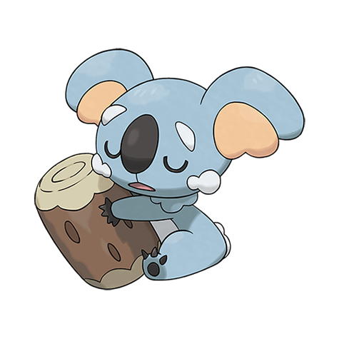

# Komala (#0775)

*Drowsing Pokemon*

**Type:** Normale
**Abilities:** [[Comatose]]
**Base HP:** 4

> Komalas are born, live, and die asleep. They will have nightmares if you remove their log-pillow. Although it appears aware of its surroundings in reality it is just dreaming and reacting to the dream antics.

---

## Statistiche (Attributes & Limits)

| Attribute | Base / Limit |
|---|---|
| **Strength** | 3/6 |
| **Dexterity** | 2/4 |
| **Vitality** | 2/4 |
| **Special** | 2/5 |
| **Insight** | 3/6 |

---

## Mosse (Learnset)

- **Starter:** [[Defense_Curl|Defense Curl]], [[Rollout|Rollout]]
- **Beginner:** [[Stockpile|Stockpile]], [[Spit_Up|Spit Up]], [[Swallow|Swallow]]
- **Amateur:** [[Rapid_Spin|Rapid Spin]], [[Yawn|Yawn]], [[Slam|Slam]], [[Flail|Flail]], [[Sucker_Punch|Sucker Punch]], [[Psych_Up|Psych Up]]
- **Ace:** [[Wood_Hammer|Wood Hammer]], [[Thrash|Thrash]]
- **Pro:** [[Facade|Facade]], [[Substitute|Substitute]], [[Play_Rough|Play Rough]]

---

