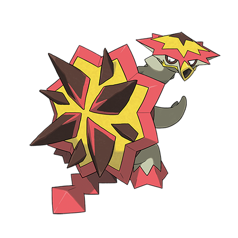

# Turtonator (#0776)

*Blast Turtle Pokemon*

**Type:** Fuoco / Drago
**Abilities:** [[Shell Armor]]
**Base HP:** 4

> It leaves in the volcanic areas of Alola, where it disguises itself among the rocks, waiting for prey to step on it to detonate an explosion. The hole on its chest is a weak point, but it is very difficult to access.

---

## Statistiche (Attributes & Limits)

| Attribute | Base / Limit |
|---|---|
| **Strength** | 2/5 |
| **Dexterity** | 1/3 |
| **Vitality** | 3/7 |
| **Special** | 2/5 |
| **Insight** | 2/5 |

---

## Mosse (Learnset)

- **Starter:** [[Ember|Ember]], [[Tackle|Tackle]]
- **Beginner:** [[Smog|Smog]], [[Protect|Protect]]
- **Amateur:** [[Incinerate|Incinerate]], [[Flail|Flail]], [[Endure|Endure]], [[Iron_Defense|Iron Defense]], [[Flamethrower|Flamethrower]], [[Body_Slam|Body Slam]], [[Shell_Smash|Shell Smash]], [[Dragon_Pulse|Dragon Pulse]]
- **Ace:** [[Shell_Trap|Shell Trap]], [[Overheat|Overheat]], [[Explosion|Explosion]]
- **Pro:** [[Head_Smash|Head Smash]], [[Flame_Charge|Flame Charge]], [[Wide_Guard|Wide Guard]]

---

