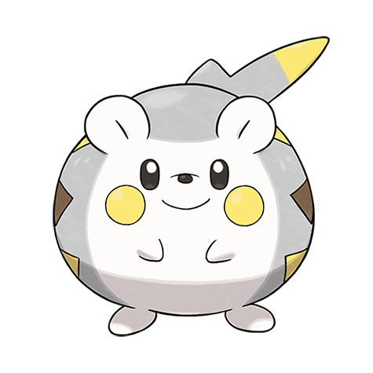

# Togedemaru (#0777)

*Roly-Poly Pokemon*

**Type:** Elettro / Acciaio
**Abilities:** [[Iron Barbs]], [[Lightning Rod]], [[Sturdy]] *(Hidden)*
**Base HP:** 4

> On stormy days you can see groups of Togedemaru curled up into balls with their spikes out, waiting to be struck by lightning. These spikes also deter other Pokemon from attacking this cute creature.

---

## Statistiche (Attributes & Limits)

| Attribute | Base / Limit |
|---|---|
| **Strength** | 3/6 |
| **Dexterity** | 3/6 |
| **Vitality** | 2/4 |
| **Special** | 2/4 |
| **Insight** | 2/5 |

---

## Mosse (Learnset)

- **Starter:** [[Tackle|Tackle]], [[Defense_Curl|Defense Curl]]
- **Beginner:** [[Thunder_Shock|Thunder Shock]], [[Rollout|Rollout]], [[Charge|Charge]]
- **Amateur:** [[Spark|Spark]], [[Nuzzle|Nuzzle]], [[Magnet_Rise|Magnet Rise]], [[Discharge|Discharge]], [[Zing_Zap|Zing Zap]], [[Electric_Terrain|Electric Terrain]], [[Wild_Charge|Wild Charge]]
- **Ace:** [[Pin_Missile|Pin Missile]], [[Spiky_Shield|Spiky Shield]], [[Fell_Stinger|Fell Stinger]]
- **Pro:** [[Tickle|Tickle]], [[Disarming_Voice|Disarming Voice]], [[Present|Present]]

---

