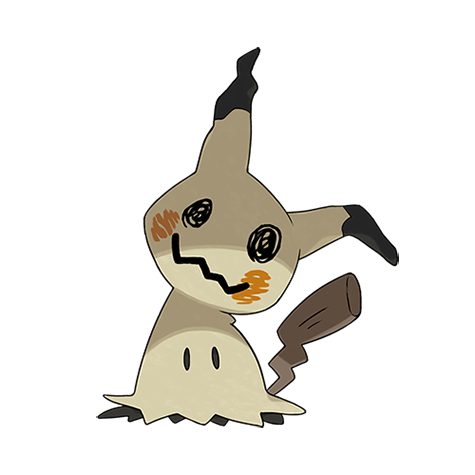

# Mimikyu (#0778)

*Disguise Pokemon*

**Type:** Spettro / Folletto
**Abilities:** [[Disguise]]
**Base HP:** 4

> No one really knows what its true form looks like, the only scholar that dared to look under the veil died on the spot from the horror. It disguises itself as a Pikachu in an effort to make friends.

---

## Statistiche (Attributes & Limits)

| Attribute | Base / Limit |
|---|---|
| **Strength** | 2/5 |
| **Dexterity** | 3/6 |
| **Vitality** | 2/5 |
| **Special** | 2/4 |
| **Insight** | 3/6 |

---

## Mosse (Learnset)

- **Starter:** [[Scratch|Scratch]], [[Splash|Splash]], [[Astonish|Astonish]]
- **Beginner:** [[Baby_Doll_Eyes|Baby-Doll Eyes]], [[Copycat|Copycat]], [[Double_Team|Double Team]]
- **Amateur:** [[Play_Rough|Play Rough]], [[Shadow_Sneak|Shadow Sneak]], [[Mimic|Mimic]], [[Feint_Attack|Feint Attack]], [[Charm|Charm]], [[Slash|Slash]], [[Shadow_Claw|Shadow Claw]], [[Hone_Claws|Hone Claws]]
- **Ace:** [[Wood_Hammer|Wood Hammer]], [[Pain_Split|Pain Split]]
- **Pro:** [[Destiny_Bond|Destiny Bond]], [[Curse|Curse]], [[Grudge|Grudge]]

---

