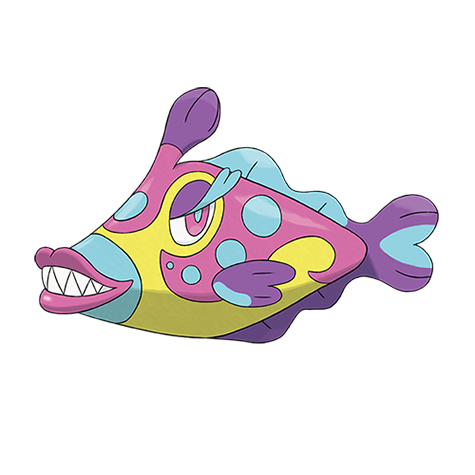

# Bruxish (#0779)

*Gnash Teeth Pokemon*

**Type:** Acqua / Psico
**Abilities:** [[Dazzling]], [[Strong Jaw]], [[Wonder Skin]] *(Hidden)*
**Base HP:** 4

> The protuberance on its head emits psychic waves that confuse its prey, while it is confused Bruxish grinds it with its sharp teeth. This grinding noise makes other Pokemon flee from the place in hurry.

---

## Statistiche (Attributes & Limits)

| Attribute | Base / Limit |
|---|---|
| **Strength** | 3/6 |
| **Dexterity** | 2/5 |
| **Vitality** | 2/5 |
| **Special** | 2/5 |
| **Insight** | 2/5 |

---

## Mosse (Learnset)

- **Starter:** [[Water_Gun|Water Gun]], [[Astonish|Astonish]]
- **Beginner:** [[Confusion|Confusion]], [[Bite|Bite]]
- **Amateur:** [[Aqua_Jet|Aqua Jet]], [[Disable|Disable]], [[Psywave|Psywave]], [[Crunch|Crunch]], [[Aqua_Tail|Aqua Tail]], [[Screech|Screech]]
- **Ace:** [[Psychic_Fangs|Psychic Fangs]], [[Synchronoise|Synchronoise]]
- **Pro:** [[Ice_Fang|Ice Fang]], [[Poison_Fang|Poison Fang]], [[Waterfall|Waterfall]]

---

