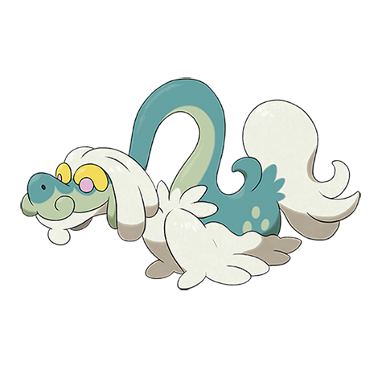

# Drampa (#0780)

*Placid Pokemon*

**Type:** Normale / Drago
**Abilities:** [[Berserk]], [[Sap Sipper]], [[Cloud Nine]] *(Hidden)*
**Base HP:** 4

> They live alone at the top of high mountains but come down in the morning to eat berries. It is a caring Pokemon, specially towards children and will fiercely protect any children it cares for with tremendous force.

---

## Statistiche (Attributes & Limits)

| Attribute | Base / Limit |
|---|---|
| **Strength** | 2/5 |
| **Dexterity** | 1/3 |
| **Vitality** | 2/5 |
| **Special** | 3/7 |
| **Insight** | 2/5 |

---

## Mosse (Learnset)

- **Starter:** [[Play_Nice|Play Nice]]
- **Beginner:** [[Echoed_Voice|Echoed Voice]], [[Twister|Twister]], [[Protect|Protect]]
- **Amateur:** [[Glare|Glare]], [[Light_Screen|Light Screen]], [[Dragon_Rage|Dragon Rage]], [[Natural_Gift|Natural Gift]], [[Dragon_Breath|Dragon Breath]], [[Safeguard|Safeguard]], [[Extrasensory|Extrasensory]], [[Dragon_Pulse|Dragon Pulse]], [[Fly|Fly]]
- **Ace:** [[Hyper_Voice|Hyper Voice]], [[Outrage|Outrage]]
- **Pro:** [[Rain_Dance|Rain Dance]], [[Play_Rough|Play Rough]], [[Hurricane|Hurricane]]

---

