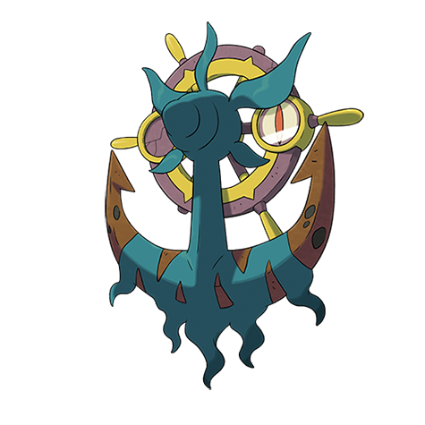

# Dhelmise (#0781)

*Sea Creeper Pokemon*

**Type:** Spettro / Erba
**Abilities:** [[Steelworker]]
**Base HP:** 5

> A spirit adrift in the sea came back to life through this Pokemon that rarely leaves the deepest waters of the sea. Through the sea some Wailord carcasses have been found covered in seaweed and gashes.

---

## Statistiche (Attributes & Limits)

| Attribute | Base / Limit |
|---|---|
| **Strength** | 3/7 |
| **Dexterity** | 1/3 |
| **Vitality** | 3/6 |
| **Special** | 2/5 |
| **Insight** | 2/5 |

---

## Mosse (Learnset)

- **Starter:** [[Growth|Growth]], [[Absorb|Absorb]]
- **Beginner:** [[Mega_Drain|Mega Drain]], [[Rapid_Spin|Rapid Spin]], [[Astonish|Astonish]]
- **Amateur:** [[Switcheroo|Switcheroo]], [[Wrap|Wrap]], [[Gyro_Ball|Gyro Ball]], [[Metal_Sound|Metal Sound]], [[Giga_Drain|Giga Drain]], [[Whirlpool|Whirlpool]], [[Anchor_Shot|Anchor Shot]], [[Shadow_Ball|Shadow Ball]], [[Slam|Slam]]
- **Ace:** [[Energy_Ball|Energy Ball]], [[Heavy_Slam|Heavy Slam]], [[Shadow_Force|Shadow Force]], [[Power_Whip|Power Whip]]
- **Pro:** [[Surf|Surf]], [[Grass_Knot|Grass Knot]], [[Brutal_Swing|Brutal Swing]]

---

