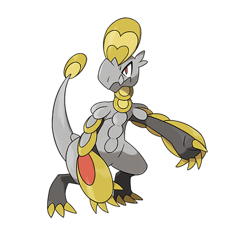

# Hakamo-o (#0783)

*Scaly Pokemon*

**Type:** Drago / Lotta
**Abilities:** [[Bulletproof]], [[Soundproof]], [[Overcoat]] *(Hidden)*
**Base HP:** 4

> The scales on its body are shed and regrow sharper each time. It is a courageous and diligent Pokemon who always lets out a war cry before the battle. Any marks on its scale armor is worn with pride.

---

## Statistiche (Attributes & Limits)

| Attribute | Base / Limit |
|---|---|
| **Strength** | 2/5 |
| **Dexterity** | 2/4 |
| **Vitality** | 2/5 |
| **Special** | 2/4 |
| **Insight** | 2/5 |

---

## Mosse (Learnset)

- **Starter:** [[Tackle|Tackle]], [[Leer|Leer]]
- **Beginner:** [[Bide|Bide]], [[Protect|Protect]]
- **Amateur:** [[Sky_Uppercut|Sky Uppercut]], [[Dragon_Tail|Dragon Tail]], [[Scary_Face|Scary Face]], [[Headbutt|Headbutt]], [[Work_Up|Work Up]], [[Screech|Screech]], [[Iron_Defense|Iron Defense]], [[Dragon_Claw|Dragon Claw]], [[Noble_Roar|Noble Roar]]
- **Ace:** [[Autotomize|Autotomize]], [[Dragon_Dance|Dragon Dance]], [[Outrage|Outrage]]
- **Pro:** [[Counter|Counter]], [[Reversal|Reversal]], [[Dragon_Breath|Dragon Breath]]

---

## Correlati

### Catena Evolutiva
- [[0782_Jangmo_o|Jangmo-o]]
- [[0783_Hakamo_o|Hakamo-o]]
- [[0784_Kommo_o|Kommo-o]]

