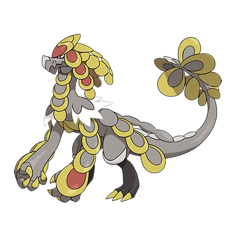

# Kommo-o (#0784)

*Scaly Pokemon*

**Type:** Drago / Lotta
**Abilities:** [[Bulletproof]], [[Soundproof]], [[Overcoat]] *(Hidden)*
**Base HP:** 5

> It completed its harsh training and returns to the mountain where it was born to look after the young Jangmo-o, watching them from afar. It is constantly looking for strong opponents.

---

## Statistiche (Attributes & Limits)

| Attribute | Base / Limit |
|---|---|
| **Strength** | 3/6 |
| **Dexterity** | 2/5 |
| **Vitality** | 3/7 |
| **Special** | 3/6 |
| **Insight** | 3/6 |

---

## Mosse (Learnset)

- **Starter:** [[Tackle|Tackle]], [[Leer|Leer]]
- **Beginner:** [[Bide|Bide]], [[Protect|Protect]]
- **Amateur:** [[Sky_Uppercut|Sky Uppercut]], [[Iron_Defense|Iron Defense]], [[Dragon_Tail|Dragon Tail]], [[Noble_Roar|Noble Roar]], [[Headbutt|Headbutt]], [[Scary_Face|Scary Face]], [[Screech|Screech]], [[Work_Up|Work Up]], [[Dragon_Claw|Dragon Claw]]
- **Ace:** [[Belly_Drum|Belly Drum]], [[Clanging_Scales|Clanging Scales]], [[Autotomize|Autotomize]], [[Dragon_Dance|Dragon Dance]], [[Outrage|Outrage]]
- **Pro:** [[Focus_Blast|Focus Blast]], [[Flash_Cannon|Flash Cannon]], [[Draco_Meteor|Draco Meteor]]

---

## Correlati

### Catena Evolutiva
- [[0782_Jangmo_o|Jangmo-o]]
- [[0783_Hakamo_o|Hakamo-o]]
- [[0784_Kommo_o|Kommo-o]]

