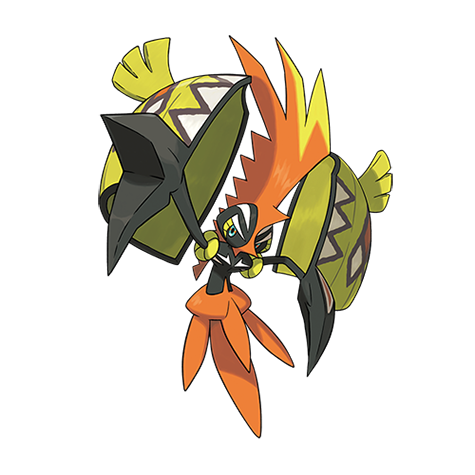

# Tapu Koko (#0785)

*No Data*

**Type:** Elettro / Folletto
**Abilities:** [[Electric Surge]], [[Telepathy]] *(Hidden)*
**Base HP:** 4

> People on Melemele island talk about a guardian spirit who punishes the evil doers with lightning strikes. If it appears in front of you who knows what its intentions may be.

---

## Statistiche (Attributes & Limits)

| Attribute | Base / Limit |
|---|---|
| **Strength** | 6/6 |
| **Dexterity** | 7/7 |
| **Vitality** | 5/5 |
| **Special** | 6/6 |
| **Insight** | 5/5 |

---

## Mosse (Learnset)

- **Master:** [[Electric_Terrain|Electric Terrain]], [[Brave_Bird|Brave Bird]], [[Power_Swap|Power Swap]], [[Mean_Look|Mean Look]], [[Quick_Attack|Quick Attack]], [[False_Swipe|False Swipe]], [[Withdraw|Withdraw]], [[Thunder_Shock|Thunder Shock]], [[Spark|Spark]], [[Shock_Wave|Shock Wave]], [[Screech|Screech]], [[Charge|Charge]], [[Wild_Charge|Wild Charge]], [[Mirror_Move|Mirror Move]], [[Natures_Madness|Nature's Madness]], [[Discharge|Discharge]], [[Agility|Agility]], [[Electro_Ball|Electro Ball]], [[Iron_Defense|Iron Defense]], [[Sky_Attack|Sky Attack]], [[Telekinesis|Telekinesis]], [[Defog|Defog]]

---

