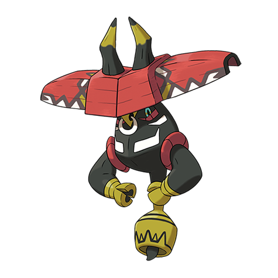

# Tapu Bulu (#0787)

*No Data*

**Type:** Erba / Folletto
**Abilities:** [[Grassy Surge]], [[Telepathy]] *(Hidden)*
**Base HP:** 4

> Through Ula'ula island runs the legend of a lazy guardian spirit who lives among the trees, which it commands to restrain its foes before beating them.

---

## Statistiche (Attributes & Limits)

| Attribute | Base / Limit |
|---|---|
| **Strength** | 7/7 |
| **Dexterity** | 5/5 |
| **Vitality** | 6/6 |
| **Special** | 5/5 |
| **Insight** | 6/6 |

---

## Mosse (Learnset)

- **Master:** [[Grassy_Terrain|Grassy Terrain]], [[Wood_Hammer|Wood Hammer]], [[Superpower|Superpower]], [[Mean_Look|Mean Look]], [[Disable|Disable]], [[Whirlwind|Whirlwind]], [[Withdraw|Withdraw]], [[Leafage|Leafage]], [[Horn_Attack|Horn Attack]], [[Giga_Drain|Giga Drain]], [[Scary_Face|Scary Face]], [[Leech_Seed|Leech Seed]], [[Horn_Leech|Horn Leech]], [[Rototiller|Rototiller]], [[Natures_Madness|Nature's Madness]], [[Zen_Headbutt|Zen Headbutt]], [[Megahorn|Megahorn]], [[Skull_Bash|Skull Bash]], [[Iron_Defense|Iron Defense]], [[Dual_Chop|Dual Chop]], [[Focus_Punch|Focus Punch]], [[Worry_Seed|Worry Seed]]

---

