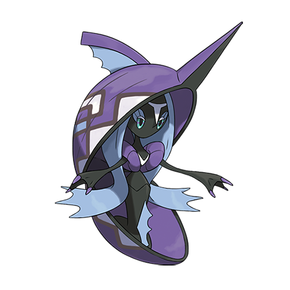

# Tapu Fini (#0788)

*No Data*

**Type:** Acqua / Folletto
**Abilities:** [[Misty Surge]], [[Telepathy]] *(Hidden)*
**Base HP:** 4

> The people on Poni island are proud of the clean water on their land, for that they thank their guardian spirit who is said to be the ocean itself.

---

## Statistiche (Attributes & Limits)

| Attribute | Base / Limit |
|---|---|
| **Strength** | 5/5 |
| **Dexterity** | 5/5 |
| **Vitality** | 6/6 |
| **Special** | 6/6 |
| **Insight** | 7/7 |

---

## Mosse (Learnset)

- **Master:** [[Misty_Terrain|Misty Terrain]], [[Moonblast|Moonblast]], [[Heal_Pulse|Heal Pulse]], [[Mean_Look|Mean Look]], [[Haze|Haze]], [[Mist|Mist]], [[Withdraw|Withdraw]], [[Water_Gun|Water Gun]], [[Water_Pulse|Water Pulse]], [[Whirlpool|Whirlpool]], [[Soak|Soak]], [[Refresh|Refresh]], [[Brine|Brine]], [[Defog|Defog]], [[Natures_Madness|Nature's Madness]], [[Muddy_Water|Muddy Water]], [[Aqua_Ring|Aqua Ring]], [[Hydro_Pump|Hydro Pump]], [[Iron_Defense|Iron Defense]], [[Icy_Wind|Icy Wind]], [[Wonder_Room|Wonder Room]], [[Knock_Off|Knock Off]]

---

