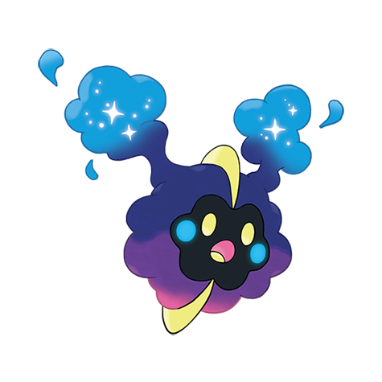

# Cosmog (#0789)

*No Data*

**Type:** Psico
**Abilities:** [[Unaware]]
**Base HP:** 3

> A creature like this was observed on a telescope. It is rumored to be a Pokemon from another world, but no specific details are known.

---

## Statistiche (Attributes & Limits)

| Attribute | Base / Limit |
|---|---|
| **Strength** | 1/3 |
| **Dexterity** | 1/3 |
| **Vitality** | 1/3 |
| **Special** | 1/3 |
| **Insight** | 1/3 |

---

## Mosse (Learnset)

- **Starter:** [[Splash|Splash]], [[Teleport|Teleport]]

---

## Correlati

### Catena Evolutiva
- [[0789_Cosmog|Cosmog]]
- [[0790_Cosmoem|Cosmoem]]
- [[0791_Solgaleo|Solgaleo]]
- [[0792_Lunala|Lunala]]

