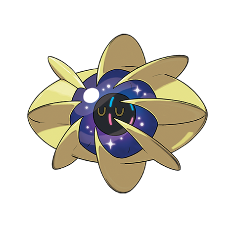

# Cosmoem (#0790)

*No Data*

**Type:** Psico
**Abilities:** [[Sturdy]]
**Base HP:** 4

> The creature observed through the telescope changed shapes and remained motionless for the rest of the investigation. A strange energy was gathering on its core.

---

## Statistiche (Attributes & Limits)

| Attribute | Base / Limit |
|---|---|
| **Strength** | 3/3 |
| **Dexterity** | 3/3 |
| **Vitality** | 7/7 |
| **Special** | 3/3 |
| **Insight** | 7/7 |

---

## Mosse (Learnset)

- **Starter:** [[Splash|Splash]], [[Teleport|Teleport]]
- **Amateur:** [[Cosmic_Power|Cosmic Power]]

---

## Correlati

### Catena Evolutiva
- [[0789_Cosmog|Cosmog]]
- [[0790_Cosmoem|Cosmoem]]
- [[0791_Solgaleo|Solgaleo]]
- [[0792_Lunala|Lunala]]

