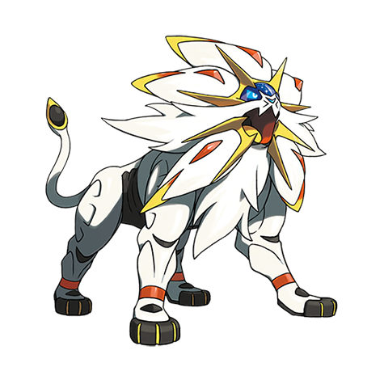

# Solgaleo (#0791)

*No Data*

**Type:** Psico / Acciaio
**Abilities:** [[Full Metal Body]]
**Base HP:** 7

> There are legends about a being that radiated with the sun, on its forehead a third eye that connected to another dimension.

---

## Statistiche (Attributes & Limits)

| Attribute | Base / Limit |
|---|---|
| **Strength** | 7/7 |
| **Dexterity** | 6/6 |
| **Vitality** | 6/6 |
| **Special** | 5/5 |
| **Insight** | 5/5 |

---

## Mosse (Learnset)

- **Master:** [[Sunsteel_Strike|Sunsteel Strike]], [[Cosmic_Power|Cosmic Power]], [[Wake_Up_Slap|Wake-Up Slap]], [[Teleport|Teleport]], [[Metal_Claw|Metal Claw]], [[Iron_Head|Iron Head]], [[Iron_Head|Iron Head]], [[Zen_Headbutt|Zen Headbutt]], [[Flash_Cannon|Flash Cannon]], [[Morning_Sun|Morning Sun]], [[Crunch|Crunch]], [[Metal_Burst|Metal Burst]], [[Solar_Beam|Solar Beam]], [[Noble_Roar|Noble Roar]], [[Flare_Blitz|Flare Blitz]], [[Wide_Guard|Wide Guard]], [[Giga_Impact|Giga Impact]], [[Sunny_Day|Sunny Day]], [[Light_Screen|Light Screen]], [[Outrage|Outrage]], [[Flame_Charge|Flame Charge]], [[Dazzling_Gleam|Dazzling Gleam]]

---

## Correlati

### Catena Evolutiva
- [[0789_Cosmog|Cosmog]]
- [[0790_Cosmoem|Cosmoem]]
- [[0791_Solgaleo|Solgaleo]]
- [[0792_Lunala|Lunala]]

