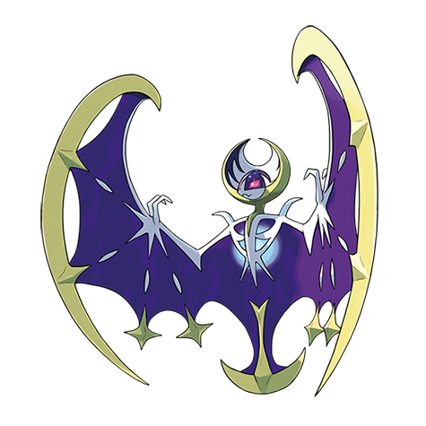

# Lunala (#0792)

*No Data*

**Type:** Psico / Spettro
**Abilities:** [[Shadow Shield]]
**Base HP:** 7

> There are legends about a being that shined with the moon, on its forehead a third eye that connected to another dimension.

---

## Statistiche (Attributes & Limits)

| Attribute | Base / Limit |
|---|---|
| **Strength** | 6/6 |
| **Dexterity** | 6/6 |
| **Vitality** | 5/5 |
| **Special** | 7/7 |
| **Insight** | 6/6 |

---

## Mosse (Learnset)

- **Master:** [[Moongeist_Beam|Moongeist Beam]], [[Cosmic_Power|Cosmic Power]], [[Hypnosis|Hypnosis]], [[Teleport|Teleport]], [[Confusion|Confusion]], [[Night_Shade|Night Shade]], [[Confuse_Ray|Confuse Ray]], [[Air_Slash|Air Slash]], [[Shadow_Ball|Shadow Ball]], [[Moonlight|Moonlight]], [[Night_Daze|Night Daze]], [[Magic_Coat|Magic Coat]], [[Moonblast|Moonblast]], [[Dream_Eater|Dream Eater]], [[Phantom_Force|Phantom Force]], [[Wide_Guard|Wide Guard]], [[Hyper_Beam|Hyper Beam]], [[Tailwind|Tailwind]], [[Icy_Wind|Icy Wind]], [[Spite|Spite]], [[Heat_Wave|Heat Wave]], [[Reflect|Reflect]]

---

## Correlati

### Catena Evolutiva
- [[0789_Cosmog|Cosmog]]
- [[0790_Cosmoem|Cosmoem]]
- [[0791_Solgaleo|Solgaleo]]
- [[0792_Lunala|Lunala]]

