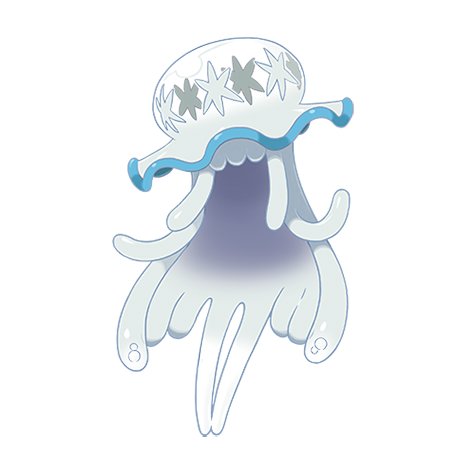

# Nihilego (#0793)

*Aether Foundation Log #047*

**Type:** Roccia / Veleno
**Abilities:** [[Beast Boost]]
**Base HP:** 5

> We are unable to determine if the creature is sentient or not, it adapts its behavior depending on its last host. It hasn’t stopped behaving like a little girl since then, it’s both unsettling and fascinating.

---

## Statistiche (Attributes & Limits)

| Attribute | Base / Limit |
|---|---|
| **Strength** | 4/4 |
| **Dexterity** | 6/6 |
| **Vitality** | 4/4 |
| **Special** | 7/7 |
| **Insight** | 7/7 |

---

## Mosse (Learnset)

- **Master:** [[Power_Split|Power Split]], [[Guard_Split|Guard Split]], [[Tickle|Tickle]], [[Acid|Acid]], [[Constrict|Constrict]], [[Pound|Pound]], [[Clear_Smog|Clear Smog]], [[Psywave|Psywave]], [[Headbutt|Headbutt]], [[Venoshock|Venoshock]], [[Toxic_Spikes|Toxic Spikes]], [[Safeguard|Safeguard]], [[Power_Gem|Power Gem]], [[Mirror_Coat|Mirror Coat]], [[Acid_Spray|Acid Spray]], [[Venom_Drench|Venom Drench]], [[Stealth_Rock|Stealth Rock]], [[Wonder_Room|Wonder Room]], [[Head_Smash|Head Smash]], [[Pain_Split|Pain Split]], [[Role_Play|Role Play]], [[Gunk_Shot|Gunk Shot]]

---

