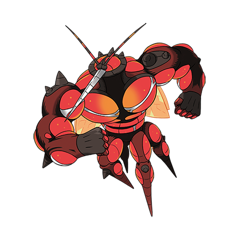

# Buzzwole (#0794)

*Aether Foundation Log #071*

**Type:** Insetto / Lotta
**Abilities:** [[Beast Boost]]
**Base HP:** 5

> What we thought were harmless displays of strength were just the first warning signs. Today UB-02 destroyed the truck where it was being transported, it escaped and hasn’t been located.

---

## Statistiche (Attributes & Limits)

| Attribute | Base / Limit |
|---|---|
| **Strength** | 7/7 |
| **Dexterity** | 5/5 |
| **Vitality** | 7/7 |
| **Special** | 4/4 |
| **Insight** | 4/4 |

---

## Mosse (Learnset)

- **Master:** [[Fell_Stinger|Fell Stinger]], [[Thunder_Punch|Thunder Punch]], [[Ice_Punch|Ice Punch]], [[Power_Up_Punch|Power-Up Punch]], [[Reversal|Reversal]], [[Focus_Energy|Focus Energy]], [[Comet_Punch|Comet Punch]], [[Harden|Harden]], [[Bulk_Up|Bulk Up]], [[Vital_Throw|Vital Throw]], [[Endure|Endure]], [[Leech_Life|Leech Life]], [[Taunt|Taunt]], [[Mega_Punch|Mega Punch]], [[Counter|Counter]], [[Hammer_Arm|Hammer Arm]], [[Lunge|Lunge]], [[Dynamic_Punch|Dynamic Punch]], [[Superpower|Superpower]], [[Focus_Punch|Focus Punch]], [[Drain_Punch|Drain Punch]], [[Outrage|Outrage]], [[Stomping_Tantrum|Stomping Tantrum]]

---

