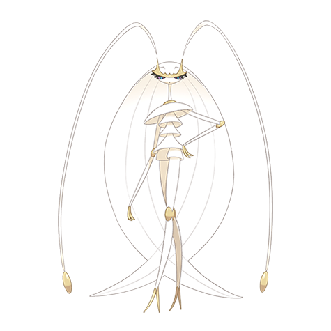

# Pheromosa (#0795)

*Aether Foundation Log #012*

**Type:** Insetto / Lotta
**Abilities:** [[Beast Boost]]
**Base HP:** 4

> This one also appears to be unable to enter a Pokeball, the rays just won’t surround them. This one has refused to touch anything we give to it and appears displeased by my mere presence.

---

## Statistiche (Attributes & Limits)

| Attribute | Base / Limit |
|---|---|
| **Strength** | 7/7 |
| **Dexterity** | 8/8 |
| **Vitality** | 3/3 |
| **Special** | 7/7 |
| **Insight** | 3/3 |

---

## Mosse (Learnset)

- **Master:** [[Quiver_Dance|Quiver Dance]], [[Quick_Guard|Quick Guard]], [[Low_Kick|Low Kick]], [[Rapid_Spin|Rapid Spin]], [[Leer|Leer]], [[Double_Kick|Double Kick]], [[Swift|Swift]], [[Stomp|Stomp]], [[Feint|Feint]], [[Silver_Wind|Silver Wind]], [[Bounce|Bounce]], [[Jump_Kick|Jump Kick]], [[Agility|Agility]], [[Triple_Kick|Triple Kick]], [[Lunge|Lunge]], [[Bug_Buzz|Bug Buzz]], [[Me_First|Me First]], [[High_Jump_Kick|High Jump Kick]], [[Speed_Swap|Speed Swap]], [[Throat_Chop|Throat Chop]], [[Shock_Wave|Shock Wave]], [[Outrage|Outrage]]

---

