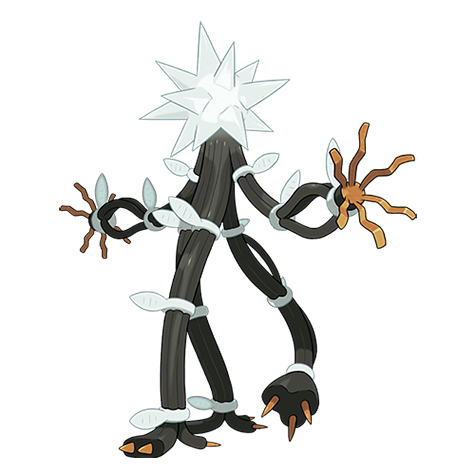

# Xurkitree (#0796)

*Aether Foundation Log #067*

**Type:** Elettro
**Abilities:** [[Beast Boost]]
**Base HP:** 4

> My superiors are furious. A lot of money had to be used to cover the damages UB-03 dealt in the power plant. On the bright side, it seems a lot livelier now that it appears to have recharged.

---

## Statistiche (Attributes & Limits)

| Attribute | Base / Limit |
|---|---|
| **Strength** | 5/5 |
| **Dexterity** | 5/5 |
| **Vitality** | 5/5 |
| **Special** | 9/9 |
| **Insight** | 5/5 |

---

## Mosse (Learnset)

- **Master:** [[Tail_Glow|Tail Glow]], [[Spark|Spark]], [[Charge|Charge]], [[Wrap|Wrap]], [[Thunder_Shock|Thunder Shock]], [[Thunder_Wave|Thunder Wave]], [[Shock_Wave|Shock Wave]], [[Ingrain|Ingrain]], [[Thunder_Punch|Thunder Punch]], [[Eerie_Impulse|Eerie Impulse]], [[Signal_Beam|Signal Beam]], [[Thunderbolt|Thunderbolt]], [[Hypnosis|Hypnosis]], [[Discharge|Discharge]], [[Electric_Terrain|Electric Terrain]], [[Power_Whip|Power Whip]], [[Ion_Deluge|Ion Deluge]], [[Zap_Cannon|Zap Cannon]], [[Magnet_Rise|Magnet Rise]], [[Brutal_Swing|Brutal Swing]], [[Electroweb|Electroweb]]

---

