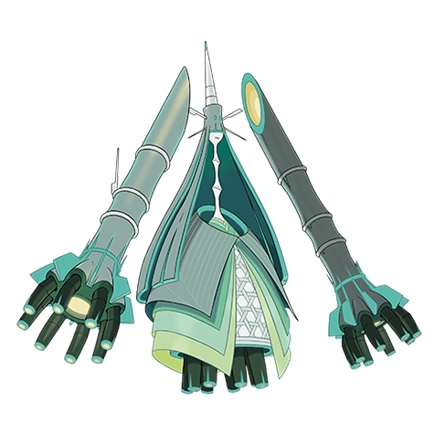

# Celesteela (#0797)

*Aether Foundation Log #019*

**Type:** Acciaio / Volante
**Abilities:** [[Beast Boost]]
**Base HP:** 9

> Finally some progress from the excavation site. What we thought was a 200 year-old relic turned out to be a creature capable of blasting itself into the air, we managed to restrain it, more research is due.

---

## Statistiche (Attributes & Limits)

| Attribute | Base / Limit |
|---|---|
| **Strength** | 6/6 |
| **Dexterity** | 4/4 |
| **Vitality** | 6/6 |
| **Special** | 6/6 |
| **Insight** | 6/6 |

---

## Mosse (Learnset)

- **Master:** [[Wide_Guard|Wide Guard]], [[Air_Slash|Air Slash]], [[Ingrain|Ingrain]], [[Absorb|Absorb]], [[Harden|Harden]], [[Tackle|Tackle]], [[Smack_Down|Smack Down]], [[Mega_Drain|Mega Drain]], [[Leech_Seed|Leech Seed]], [[Metal_Sound|Metal Sound]], [[Iron_Head|Iron Head]], [[Giga_Drain|Giga Drain]], [[Flash_Cannon|Flash Cannon]], [[Autotomize|Autotomize]], [[Seed_Bomb|Seed Bomb]], [[Skull_Bash|Skull Bash]], [[Iron_Defense|Iron Defense]], [[Heavy_Slam|Heavy Slam]], [[Double_Edge|Double-Edge]], [[Flame_Charge|Flame Charge]], [[Magnet_Rise|Magnet Rise]], [[Fly|Fly]]

---

