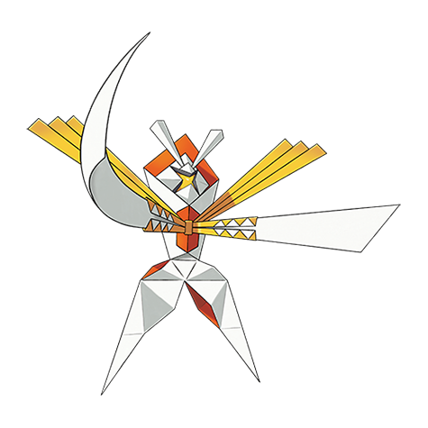

# Kartana (#0798)

*Aether Foundation Log #014*

**Type:** Erba / Acciaio
**Abilities:** [[Beast Boost]]
**Base HP:** 4

> Its paper-thin body and agility make it too dangerous to approach without serious risk of injury. Our team managed to immobilize it using a heat chamber, though I swear I feel its resentment to us.

---

## Statistiche (Attributes & Limits)

| Attribute | Base / Limit |
|---|---|
| **Strength** | 9/9 |
| **Dexterity** | 6/6 |
| **Vitality** | 7/7 |
| **Special** | 4/4 |
| **Insight** | 3/3 |

---

## Mosse (Learnset)

- **Master:** [[Sacred_Sword|Sacred Sword]], [[Defog|Defog]], [[Vacuum_Wave|Vacuum Wave]], [[Air_Cutter|Air Cutter]], [[Fury_Cutter|Fury Cutter]], [[Cut|Cut]], [[False_Swipe|False Swipe]], [[Razor_Leaf|Razor Leaf]], [[Synthesis|Synthesis]], [[Aerial_Ace|Aerial Ace]], [[Laser_Focus|Laser Focus]], [[Night_Slash|Night Slash]], [[Swords_Dance|Swords Dance]], [[Leaf_Blade|Leaf Blade]], [[X_Scissor|X-Scissor]], [[Detect|Detect]], [[Air_Slash|Air Slash]], [[Psycho_Cut|Psycho Cut]], [[Guillotine|Guillotine]], [[Iron_Defense|Iron Defense]], [[Knock_Off|Knock Off]], [[Tailwind|Tailwind]]

---

