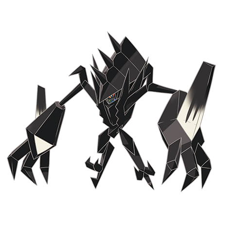

# Necrozma (#0800)

*Aether Foundation Log #179*

**Type:** Psico
**Abilities:** [[Prism Armor]]
**Base HP:** 4

> First it was just a passing shadow, a shady lurker on the other side of the abyss, but then today it made an appearance. the creature attached itself to our light sources, depleting them until it was all in darkness.

---

## Statistiche (Attributes & Limits)

| Attribute | Base / Limit |
|---|---|
| **Strength** | 6/6 |
| **Dexterity** | 5/5 |
| **Vitality** | 6/6 |
| **Special** | 7/7 |
| **Insight** | 5/5 |

---

## Mosse (Learnset)

- **Master:** [[Moonlight|Moonlight]], [[Morning_Sun|Morning Sun]], [[Charge_Beam|Charge Beam]], [[Mirror_Shot|Mirror Shot]], [[Metal_Claw|Metal Claw]], [[Confusion|Confusion]], [[Slash|Slash]], [[Stored_Power|Stored Power]], [[Rock_Blast|Rock Blast]], [[Night_Slash|Night Slash]], [[Gravity|Gravity]], [[Psycho_Cut|Psycho Cut]], [[Power_Gem|Power Gem]], [[Autotomize|Autotomize]], [[Photon_Geyser_(Special)|Photon Geyser (Special)]], [[Stealth_Rock|Stealth Rock]], [[Iron_Defense|Iron Defense]], [[Wring_Out|Wring Out]], [[Prismatic_Laser|Prismatic Laser]], [[Outrage|Outrage]], [[Shadow_Claw|Shadow Claw]], [[Magnet_Rise|Magnet Rise]]

---

## Correlati

### Catena Evolutiva
- [[0800_Necrozma|Necrozma]]
- Necrozma (Dusk Mane Form)
- Necrozma (Dawn Wings Form)
- Necrozma (Ultra Burst Form)

---

## Necrozma (Criniera del Tramonto) (#0800F1)

**Type:** Psico / Acciaio
**Abilities:** [[Prism Armor]]
**Base HP:** 4

| Attribute | Base / Limit |
|---|---|
| **Strength** | 8/8 |
| **Dexterity** | 5/5 |
| **Vitality** | 7/7 |
| **Special** | 6/6 |
| **Insight** | 6/6 |

### Mosse

- **Master:** [[Moonlight|Moonlight]], [[Morning_Sun|Morning Sun]], [[Charge_Beam|Charge Beam]], [[Mirror_Shot|Mirror Shot]], [[Metal_Claw|Metal Claw]], [[Confusion|Confusion]], [[Slash|Slash]], [[Stored_Power|Stored Power]], [[Rock_Blast|Rock Blast]], [[Night_Slash|Night Slash]], [[Gravity|Gravity]], [[Psycho_Cut|Psycho Cut]], [[Power_Gem|Power Gem]], [[Autotomize|Autotomize]], [[Photon_Geyser_(Special)|Photon Geyser (Special)]], [[Stealth_Rock|Stealth Rock]], [[Iron_Defense|Iron Defense]], [[Wring_Out|Wring Out]], [[Prismatic_Laser|Prismatic Laser]], [[Outrage|Outrage]], [[Shadow_Claw|Shadow Claw]], [[Magnet_Rise|Magnet Rise]], [[Sunsteel_Strike|Sunsteel Strike]]

---

## Necrozma (Ali dell'Alba) (#0800F2)

**Type:** Psico / Spettro
**Abilities:** [[Prism Armor]]
**Base HP:** 4

| Attribute | Base / Limit |
|---|---|
| **Strength** | 6/6 |
| **Dexterity** | 5/5 |
| **Vitality** | 6/6 |
| **Special** | 8/8 |
| **Insight** | 7/7 |

### Mosse

- **Master:** [[Moonlight|Moonlight]], [[Morning_Sun|Morning Sun]], [[Charge_Beam|Charge Beam]], [[Mirror_Shot|Mirror Shot]], [[Metal_Claw|Metal Claw]], [[Confusion|Confusion]], [[Slash|Slash]], [[Stored_Power|Stored Power]], [[Rock_Blast|Rock Blast]], [[Night_Slash|Night Slash]], [[Gravity|Gravity]], [[Psycho_Cut|Psycho Cut]], [[Power_Gem|Power Gem]], [[Autotomize|Autotomize]], [[Photon_Geyser_(Special)|Photon Geyser (Special)]], [[Stealth_Rock|Stealth Rock]], [[Iron_Defense|Iron Defense]], [[Wring_Out|Wring Out]], [[Prismatic_Laser|Prismatic Laser]], [[Outrage|Outrage]], [[Shadow_Claw|Shadow Claw]], [[Magnet_Rise|Magnet Rise]], [[Moongeist_Beam|Moongeist Beam]]

---

## Necrozma Ultra (#0800F3)

**Type:** Psico / Drago
**Abilities:** [[Neuroforce]]
**Base HP:** 5

| Attribute | Base / Limit |
|---|---|
| **Strength** | 8/8 |
| **Dexterity** | 7/7 |
| **Vitality** | 6/6 |
| **Special** | 8/8 |
| **Insight** | 6/6 |

### Mosse

- **Master:** [[Moonlight|Moonlight]], [[Morning_Sun|Morning Sun]], [[Charge_Beam|Charge Beam]], [[Mirror_Shot|Mirror Shot]], [[Metal_Claw|Metal Claw]], [[Confusion|Confusion]], [[Slash|Slash]], [[Stored_Power|Stored Power]], [[Rock_Blast|Rock Blast]], [[Night_Slash|Night Slash]], [[Gravity|Gravity]], [[Psycho_Cut|Psycho Cut]], [[Power_Gem|Power Gem]], [[Autotomize|Autotomize]], [[Photon_Geyser_(Special)|Photon Geyser (Special)]], [[Stealth_Rock|Stealth Rock]], [[Iron_Defense|Iron Defense]], [[Wring_Out|Wring Out]], [[Prismatic_Laser|Prismatic Laser]], [[Outrage|Outrage]], [[Dragon_Pulse|Dragon Pulse]], [[Sunsteel_Strike|Sunsteel Strike]], [[Moongeist_Beam|Moongeist Beam]]

