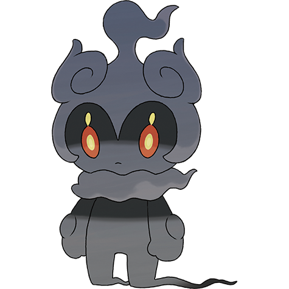

# Marshadow (#0802)

*No Data*

**Type:** Lotta / Spettro
**Abilities:** [[Technician]]
**Base HP:** 4

> There is an old children’s story about a boy who lost his shadow and the shadow became a Pokemon. It is debated which Pokemon the story is making mention of.

---

## Statistiche (Attributes & Limits)

| Attribute | Base / Limit |
|---|---|
| **Strength** | 7/7 |
| **Dexterity** | 7/7 |
| **Vitality** | 5/5 |
| **Special** | 5/5 |
| **Insight** | 5/5 |

---

## Mosse (Learnset)

- **Master:** [[Laser_Focus|Laser Focus]], [[Assurance|Assurance]], [[Fire_Punch|Fire Punch]], [[Ice_Punch|Ice Punch]], [[Thunder_Punch|Thunder Punch]], [[Drain_Punch|Drain Punch]], [[Counter|Counter]], [[Pursuit|Pursuit]], [[Shadow_Sneak|Shadow Sneak]], [[Force_Palm|Force Palm]], [[Feint|Feint]], [[Rolling_Kick|Rolling Kick]], [[Copycat|Copycat]], [[Shadow_Punch|Shadow Punch]], [[Role_Play|Role Play]], [[Jump_Kick|Jump Kick]], [[Psych_Up|Psych Up]], [[Spectral_Thief|Spectral Thief]], [[Close_Combat|Close Combat]], [[Sucker_Punch|Sucker Punch]], [[Endeavor|Endeavor]], [[Throat_Chop|Throat Chop]], [[Poison_Jab|Poison Jab]], [[Superpower|Superpower]]

---

