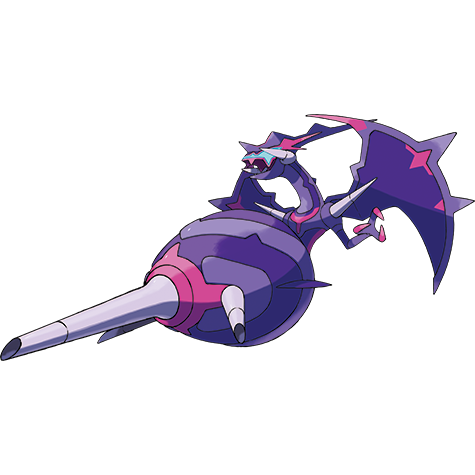

# Naganadel (#0804)

*Aether Foundation Log #164*

**Type:** Veleno / Drago
**Abilities:** [[Beast Boost]]
**Base HP:** 5

> One specimen of UB- Adhesive has apparently evolved. Its friendly demeanor is gone. The large streams of corrosive poison it shot seriously damaged our equipment, I must take a sample to study it

---

## Statistiche (Attributes & Limits)

| Attribute | Base / Limit |
|---|---|
| **Strength** | 5/5 |
| **Dexterity** | 7/7 |
| **Vitality** | 5/5 |
| **Special** | 7/7 |
| **Insight** | 5/5 |

---

## Mosse (Learnset)

- **Master:** [[Air_Cutter|Air Cutter]], [[Dragon_Pulse|Dragon Pulse]], [[Peck|Peck]], [[Growl|Growl]], [[Helping_Hand|Helping Hand]], [[Acid|Acid]], [[Fury_Attack|Fury Attack]], [[Venoshock|Venoshock]], [[Charm|Charm]], [[Venom_Drench|Venom Drench]], [[Nasty_Plot|Nasty Plot]], [[Poison_Jab|Poison Jab]], [[Toxic|Toxic]], [[Fell_Stinger|Fell Stinger]], [[Air_Slash|Air Slash]], [[Draco_Meteor|Draco Meteor]], [[Gunk_Shot|Gunk Shot]], [[Tailwind|Tailwind]], [[Sky_Attack|Sky Attack]]

---

## Correlati

### Catena Evolutiva
- [[0803_Poipole|Poipole]]
- [[0804_Naganadel|Naganadel]]

