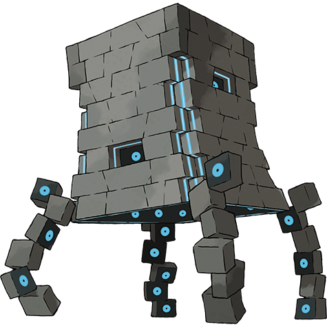

# Stakataka (#0805)

*Aether Foundation Log #132*

**Type:** Roccia / Acciaio
**Abilities:** [[Beast Boost]]
**Base HP:** 6

> We are finally on the other side. It has been so exciting. What we thought were the ruins of an abandoned civilization turned out to be small sentient creatures that stacked on each other to create a big UB.

---

## Statistiche (Attributes & Limits)

| Attribute | Base / Limit |
|---|---|
| **Strength** | 7/7 |
| **Dexterity** | 2/2 |
| **Vitality** | 10/10 |
| **Special** | 4/4 |
| **Insight** | 6/6 |

---

## Mosse (Learnset)

- **Master:** [[Protect|Protect]], [[Tackle|Tackle]], [[Rock_Slide|Rock Slide]], [[Stealth_Rock|Stealth Rock]], [[Bide|Bide]], [[Take_Down|Take Down]], [[Rock_Throw|Rock Throw]], [[Autotomize|Autotomize]], [[Iron_Defense|Iron Defense]], [[Iron_Head|Iron Head]], [[Rock_Blast|Rock Blast]], [[Wide_Guard|Wide Guard]], [[Double_Edge|Double-Edge]], [[Magnet_Rise|Magnet Rise]], [[Zen_Headbutt|Zen Headbutt]], [[Trick_Room|Trick Room]]

---

