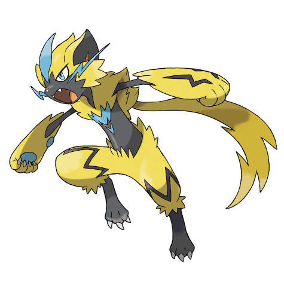

# Zeraora (#0807)

*No Data*

**Type:** Elettro
**Abilities:** [[Volt Absorb]]
**Base HP:** 4

> An unfriendly creature was spotted in Alola, witnesses mentioned it electrified its claws and tore its foes apart with them. It disappeared into the wilderness and has not been reported again.

---

## Statistiche (Attributes & Limits)

| Attribute | Base / Limit |
|---|---|
| **Strength** | 6/6 |
| **Dexterity** | 7/7 |
| **Vitality** | 5/5 |
| **Special** | 6/6 |
| **Insight** | 5/5 |

---

## Mosse (Learnset)

- **Master:** [[Scratch|Scratch]], [[Spark|Spark]], [[Hone_Claws|Hone Claws]], [[Quick_Attack|Quick Attack]], [[Fury_Swipes|Fury Swipes]], [[Volt_Switch|Volt Switch]], [[Snarl|Snarl]], [[Fake_Out|Fake Out]], [[Charge|Charge]], [[Thunder_Punch|Thunder Punch]], [[Slash|Slash]], [[Wild_Charge|Wild Charge]], [[Quick_Guard|Quick Guard]], [[Plasma_Fists|Plasma Fists]], [[Close_Combat|Close Combat]], [[Discharge|Discharge]], [[Fire_Punch|Fire Punch]], [[Drain_Punch|Drain Punch]], [[Dual_Chop|Dual Chop]]

---

