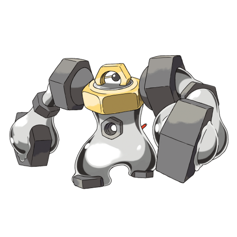

# Melmetal (#0809)

*Hex Nut Pokemon*

**Type:** Acciaio
**Abilities:** [[Iron Fist]]
**Base HP:** 6

> There is an ancient myth that a Pokemon once taught a group of humans how to work the iron, melt it and shape it into tools; but it was punished for this and cast away, never to be seen again.

---

## Statistiche (Attributes & Limits)

| Attribute | Base / Limit |
|---|---|
| **Strength** | 4/8 |
| **Dexterity** | 1/3 |
| **Vitality** | 4/8 |
| **Special** | 2/5 |
| **Insight** | 2/4 |

---

## Mosse (Learnset)

- **Starter:** [[Thunder_Punch|Thunder Punch]], [[Thunder_Shock|Thunder Shock]]
- **Beginner:** [[Harden|Harden]], [[Tail_Whip|Tail Whip]]
- **Amateur:** [[Headbutt|Headbutt]], [[Thunder_Wave|Thunder Wave]], [[Acid_Armor|Acid Armor]], [[Flash_Cannon|Flash Cannon]], [[Mega_Punch|Mega Punch]]
- **Ace:** [[Protect|Protect]], [[Discharge|Discharge]], [[Dynamic_Punch|Dynamic Punch]], [[Superpower|Superpower]], [[Double_Iron_Bash|Double Iron Bash]], [[Hyper_Beam|Hyper Beam]]
- **Pro:** [[High_Horsepower|High Horsepower]], [[Giga_Impact|Giga Impact]], [[Self_Destruct|Self Destruct]]

---

## Correlati

### Catena Evolutiva
- [[0808_Meltan|Meltan]]
- [[0809_Melmetal|Melmetal]]

