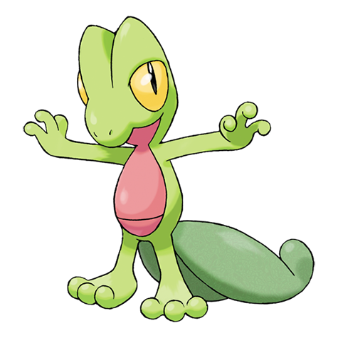

# Treecko (#0252)

*Wood Gecko Pokemon*

**Type:** Erba
**Abilities:** [[Overgrow]], [[Unburden]] *(Hidden)*
**Base HP:** 3

> They climb trees with their spiked feet. They remain cool under stress, calmed under pressure and collected when endangered. They are found protecting the trees ferociously.

---

## Statistiche (Attributes & Limits)

| Attribute | Base / Limit |
|---|---|
| **Strength** | 2/4 |
| **Dexterity** | 2/5 |
| **Vitality** | 1/3 |
| **Special** | 2/4 |
| **Insight** | 2/4 |

---

## Mosse (Learnset)

- **Starter:** [[Leer|Leer]], [[Pound|Pound]]
- **Beginner:** [[Absorb|Absorb]], [[Quick_Attack|Quick Attack]], [[Pursuit|Pursuit]]
- **Amateur:** [[Screech|Screech]], [[Mega_Drain|Mega Drain]], [[Agility|Agility]], [[Slam|Slam]]
- **Ace:** [[Detect|Detect]], [[Quick_Guard|Quick Guard]], [[Endeavor|Endeavor]], [[Giga_Drain|Giga Drain]], [[Energy_Ball|Energy Ball]]
- **Pro:** [[Iron_Tail|Iron Tail]], [[Bullet_Seed|Bullet Seed]], [[Grass_Pledge|Grass Pledge]]

---

## Correlati

### Catena Evolutiva
- [[0252_Treecko|Treecko]]
- [[0253_Grovyle|Grovyle]]
- [[0254_Sceptile|Sceptile]]
- Sceptile (Mega Form)
