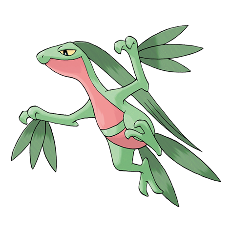

# Grovyle (#0253)

*Wood Gecko Pokemon*

**Type:** Erba
**Abilities:** [[Overgrow]], [[Unburden]] *(Hidden)*
**Base HP:** 4

> Their leaves provide camouflage in the jungles. They appear to fly from tree to tree, jumping huge lengths with amazing speed. It’s almost impossible to catch them once they start running away..

---

## Statistiche (Attributes & Limits)

| Attribute | Base / Limit |
|---|---|
| **Strength** | 2/4 |
| **Dexterity** | 3/6 |
| **Vitality** | 2/4 |
| **Special** | 2/5 |
| **Insight** | 2/4 |

---

## Mosse (Learnset)

- **Starter:** [[Pound|Pound]], [[Leer|Leer]]
- **Beginner:** [[Absorb|Absorb]], [[Quick_Attack|Quick Attack]], [[Pursuit|Pursuit]]
- **Amateur:** [[Fury_Cutter|Fury Cutter]], [[Mega_Drain|Mega Drain]], [[Screech|Screech]], [[Leaf_Blade|Leaf Blade]], [[Agility|Agility]], [[Slam|Slam]], [[False_Swipe|False Swipe]]
- **Ace:** [[X_Scissor|X-Scissor]], [[Quick_Guard|Quick Guard]], [[Detect|Detect]], [[Leaf_Storm|Leaf Storm]]
- **Pro:** [[Drain_Punch|Drain Punch]], [[Dragon_Breath|Dragon Breath]], [[Grass_Pledge|Grass Pledge]]

---

## Correlati

### Catena Evolutiva
- [[0252_Treecko|Treecko]]
- [[0253_Grovyle|Grovyle]]
- [[0254_Sceptile|Sceptile]]
- Sceptile (Mega Form)
