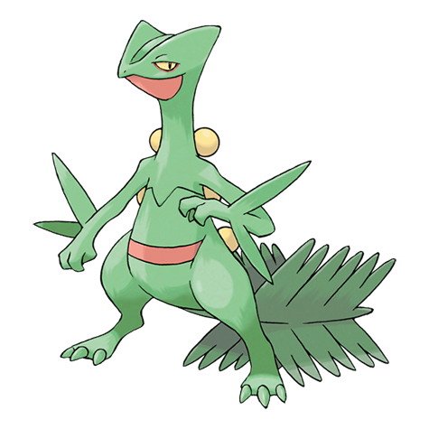
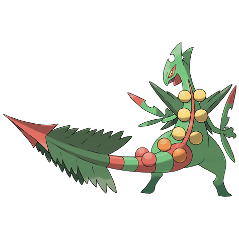

# Sceptile (#0254)

*Forest Pokemon*

**Type:** Erba
**Abilities:** [[Overgrow]], [[Unburden]] *(Hidden)*
**Base HP:** 5

> They raise trees with love and care and protect the jungles with their lives. Their tails can restore a plant’s beauty. Sceptiles power is truly unmatched in their habitats. They are very proud, though.

---

## Statistiche (Attributes & Limits)

| Attribute | Base / Limit |
|---|---|
| **Strength** | 2/5 |
| **Dexterity** | 3/7 |
| **Vitality** | 2/4 |
| **Special** | 3/6 |
| **Insight** | 2/5 |

---

## Mosse (Learnset)

- **Starter:** [[Pound|Pound]], [[Leer|Leer]]
- **Beginner:** [[Quick_Attack|Quick Attack]], [[Pursuit|Pursuit]], [[Absorb|Absorb]]
- **Amateur:** [[False_Swipe|False Swipe]], [[Leaf_Storm|Leaf Storm]], [[Mega_Drain|Mega Drain]], [[Night_Slash|Night Slash]], [[Leaf_Blade|Leaf Blade]], [[Screech|Screech]], [[Slam|Slam]], [[Agility|Agility]]
- **Ace:** [[X_Scissor|X-Scissor]], [[Detect|Detect]], [[Quick_Guard|Quick Guard]], [[Dual_Chop|Dual Chop]]
- **Pro:** [[Dragon_Pulse|Dragon Pulse]], [[Thunder_Punch|Thunder Punch]], [[Frenzy_Plant|Frenzy Plant]]

---

## Correlati

### Catena Evolutiva
- [[0252_Treecko|Treecko]]
- [[0253_Grovyle|Grovyle]]
- [[0254_Sceptile|Sceptile]]
- Sceptile (Mega Form)

---

## Mega Sceptile (#0254M1)

**Type:** Erba / Drago
**Abilities:** [[Lightning Rod]]
**Base HP:** 6

| Attribute | Base / Limit |
|---|---|
| **Strength** | 3/6 |
| **Dexterity** | 4/8 |
| **Vitality** | 2/5 |
| **Special** | 4/8 |
| **Insight** | 2/5 |

### Mosse

- **Starter:** [[Pound|Pound]], [[Leer|Leer]]
- **Beginner:** [[Quick_Attack|Quick Attack]], [[Pursuit|Pursuit]], [[Absorb|Absorb]]
- **Amateur:** [[False_Swipe|False Swipe]], [[Leaf_Storm|Leaf Storm]], [[Mega_Drain|Mega Drain]], [[Night_Slash|Night Slash]], [[Leaf_Blade|Leaf Blade]], [[Screech|Screech]], [[Slam|Slam]], [[Agility|Agility]]
- **Ace:** [[X_Scissor|X-Scissor]], [[Detect|Detect]], [[Quick_Guard|Quick Guard]], [[Dual_Chop|Dual Chop]]
- **Pro:** [[Dragon_Pulse|Dragon Pulse]], [[Thunder_Punch|Thunder Punch]], [[Frenzy_Plant|Frenzy Plant]]
