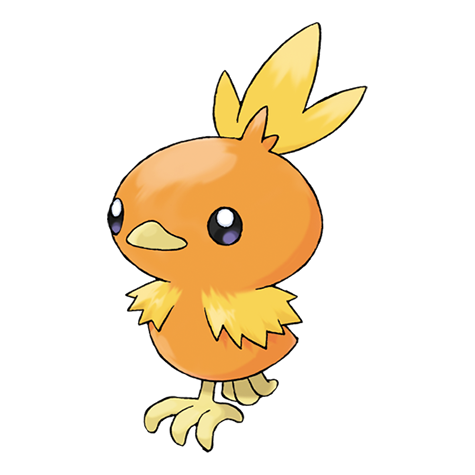

# Torchic (#0255)

*Chick Pokemon*

**Type:** Fuoco
**Abilities:** [[Blaze]], [[Speed Boost]] *(Hidden)*
**Base HP:** 3

> They walk clumsily, but follow their trainers wherever they go. Torchics have a flame sac in their belly - burning all the time. If you hug them, they feel warm, but if you squeeze them, they may spit fire.

---

## Statistiche (Attributes & Limits)

| Attribute | Base / Limit |
|---|---|
| **Strength** | 2/4 |
| **Dexterity** | 2/4 |
| **Vitality** | 1/3 |
| **Special** | 2/5 |
| **Insight** | 2/4 |

---

## Mosse (Learnset)

- **Starter:** [[Growl|Growl]], [[Scratch|Scratch]]
- **Beginner:** [[Focus_Energy|Focus Energy]], [[Ember|Ember]], [[Peck|Peck]]
- **Amateur:** [[Sand_Attack|Sand Attack]], [[Fire_Spin|Fire Spin]], [[Quick_Attack|Quick Attack]], [[Flame_Burst|Flame Burst]], [[Slash|Slash]]
- **Ace:** [[Mirror_Move|Mirror Move]], [[Flamethrower|Flamethrower]]
- **Pro:** [[Counter|Counter]], [[Feather_Dance|Feather Dance]], [[Fire_Pledge|Fire Pledge]]

---

## Correlati

### Catena Evolutiva
- [[0255_Torchic|Torchic]]
- [[0256_Combusken|Combusken]]
- [[0257_Blaziken|Blaziken]]
- Blaziken (Mega Form)
