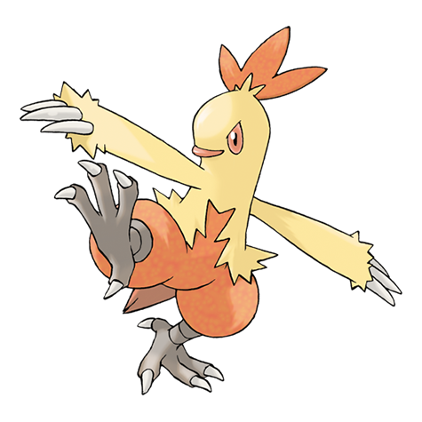

# Combusken (#0256)

*Young Fowl Pokemon*

**Type:** Fuoco / Lotta
**Abilities:** [[Blaze]], [[Speed Boost]] *(Hidden)*
**Base HP:** 4

> Once Torchic toughened up its legs and thighs, they like to run and love to kick. They have an offensive instinct to keep attacking no matter what. They sqwak loudly every morning when they start to train.

---

## Statistiche (Attributes & Limits)

| Attribute | Base / Limit |
|---|---|
| **Strength** | 2/5 |
| **Dexterity** | 2/4 |
| **Vitality** | 2/4 |
| **Special** | 2/5 |
| **Insight** | 2/4 |

---

## Mosse (Learnset)

- **Starter:** [[Growl|Growl]], [[Scratch|Scratch]]
- **Beginner:** [[Ember|Ember]], [[Focus_Energy|Focus Energy]], [[Double_Kick|Double Kick]], [[Peck|Peck]]
- **Amateur:** [[Flame_Charge|Flame Charge]], [[Sand_Attack|Sand Attack]], [[Bulk_Up|Bulk Up]], [[Quick_Attack|Quick Attack]], [[Slash|Slash]]
- **Ace:** [[Mirror_Move|Mirror Move]], [[Sky_Uppercut|Sky Uppercut]], [[Flare_Blitz|Flare Blitz]]
- **Pro:** [[Counter|Counter]], [[Feather_Dance|Feather Dance]], [[Fire_Pledge|Fire Pledge]]

---

## Correlati

### Catena Evolutiva
- [[0255_Torchic|Torchic]]
- [[0256_Combusken|Combusken]]
- [[0257_Blaziken|Blaziken]]
- Blaziken (Mega Form)
