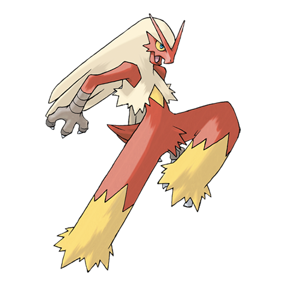
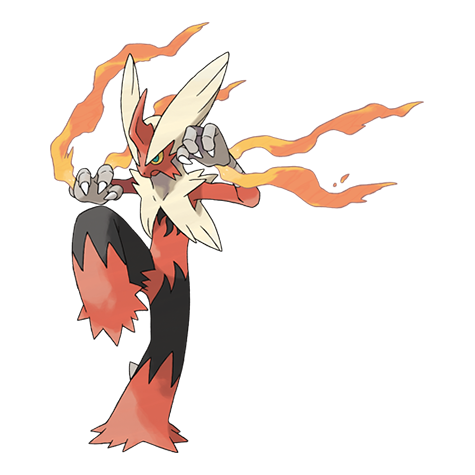

# Blaziken (#0257)

*Blaze Pokemon*

**Type:** Fuoco / Lotta
**Abilities:** [[Blaze]], [[Speed Boost]] *(Hidden)*
**Base HP:** 5

> They can jump incredible heights. As they grow older, their feathers combust as new feathers grow back. They are courageous fighters and expert martial artists. Their wrists light in flames when it’s about to attack.

---

## Statistiche (Attributes & Limits)

| Attribute | Base / Limit |
|---|---|
| **Strength** | 3/7 |
| **Dexterity** | 2/5 |
| **Vitality** | 2/5 |
| **Special** | 3/6 |
| **Insight** | 2/5 |

---

## Mosse (Learnset)

- **Starter:** [[Ember|Ember]], [[Focus_Energy|Focus Energy]]
- **Beginner:** [[Fire_Punch|Fire Punch]], [[Growl|Growl]], [[High_Jump_Kick|High Jump Kick]], [[Scratch|Scratch]]
- **Amateur:** [[Double_Kick|Double Kick]], [[Flame_Charge|Flame Charge]], [[Peck|Peck]], [[Sand_Attack|Sand Attack]], [[Bulk_Up|Bulk Up]], [[Quick_Attack|Quick Attack]], [[Blaze_Kick|Blaze Kick]], [[Slash|Slash]]
- **Ace:** [[Brave_Bird|Brave Bird]], [[Sky_Uppercut|Sky Uppercut]], [[Flare_Blitz|Flare Blitz]]
- **Pro:** [[Dual_Chop|Dual Chop]], [[Night_Slash|Night Slash]], [[Blast_Burn|Blast Burn]]

---

## Correlati

### Catena Evolutiva
- [[0255_Torchic|Torchic]]
- [[0256_Combusken|Combusken]]
- [[0257_Blaziken|Blaziken]]
- Blaziken (Mega Form)

---

## Mega Blaziken (#0257M1)

**Type:** Fuoco / Lotta
**Abilities:** [[Speed Boost]]
**Base HP:** 6

| Attribute | Base / Limit |
|---|---|
| **Strength** | 4/8 |
| **Dexterity** | 3/6 |
| **Vitality** | 2/5 |
| **Special** | 3/7 |
| **Insight** | 2/5 |

### Mosse

- **Starter:** [[Ember|Ember]], [[Focus_Energy|Focus Energy]]
- **Beginner:** [[Fire_Punch|Fire Punch]], [[Growl|Growl]], [[High_Jump_Kick|High Jump Kick]], [[Scratch|Scratch]]
- **Amateur:** [[Double_Kick|Double Kick]], [[Flame_Charge|Flame Charge]], [[Peck|Peck]], [[Sand_Attack|Sand Attack]], [[Bulk_Up|Bulk Up]], [[Quick_Attack|Quick Attack]], [[Blaze_Kick|Blaze Kick]], [[Slash|Slash]]
- **Ace:** [[Brave_Bird|Brave Bird]], [[Sky_Uppercut|Sky Uppercut]], [[Flare_Blitz|Flare Blitz]]
- **Pro:** [[Dual_Chop|Dual Chop]], [[Night_Slash|Night Slash]], [[Blast_Burn|Blast Burn]]
