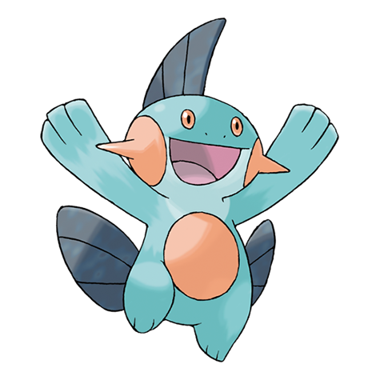

# Marshtomp (#0259)

*Mud Fish Pokemon*

**Type:** Acqua / Terra
**Abilities:** [[Torrent]], [[Damp]] *(Hidden)*
**Base HP:** 4

> A sticky film allows them to live out of water. They are seen playing in the mud at beaches to rehydrate their dry bodies. They are slow runners and swimmers but they can be fast sliding through the mud.

---

## Statistiche (Attributes & Limits)

| Attribute | Base / Limit |
|---|---|
| **Strength** | 2/5 |
| **Dexterity** | 2/4 |
| **Vitality** | 2/5 |
| **Special** | 2/4 |
| **Insight** | 2/5 |

---

## Mosse (Learnset)

- **Starter:** [[Growl|Growl]], [[Tackle|Tackle]]
- **Beginner:** [[Mud_Slap|Mud Slap]], [[Water_Gun|Water Gun]]
- **Amateur:** [[Bide|Bide]], [[Mud_Shot|Mud Shot]], [[Foresight|Foresight]], [[Mud_Bomb|Mud Bomb]], [[Rock_Slide|Rock Slide]], [[Take_Down|Take Down]], [[Muddy_Water|Muddy Water]]
- **Ace:** [[Protect|Protect]], [[Earthquake|Earthquake]], [[Endeavor|Endeavor]]
- **Pro:** [[Ice_Punch|Ice Punch]], [[Water_Pledge|Water Pledge]], [[Dynamic_Punch|Dynamic Punch]]

---

## Correlati

### Catena Evolutiva
- [[0258_Mudkip|Mudkip]]
- [[0259_Marshtomp|Marshtomp]]
- [[0260_Swampert|Swampert]]
- Swampert (Mega Form)
