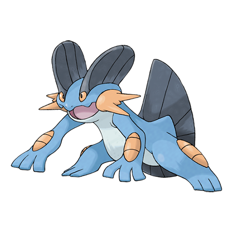
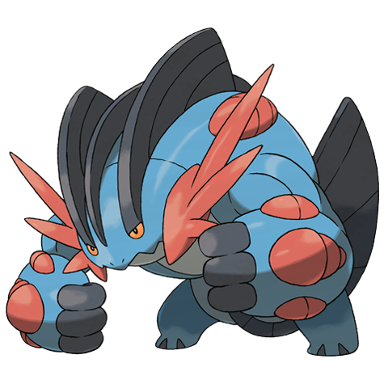

# Swampert (#0260)

*Mud Fish Pokemon*

**Type:** Acqua / Terra
**Abilities:** [[Torrent]], [[Damp]] *(Hidden)*
**Base HP:** 6

> They have an incredible sight that allows them to see in muddy water. They nest in beaches, and shield their young with their strong arms. When a storm is coming, Swamperts build a fort with big rocks.

---

## Statistiche (Attributes & Limits)

| Attribute | Base / Limit |
|---|---|
| **Strength** | 3/6 |
| **Dexterity** | 2/4 |
| **Vitality** | 2/5 |
| **Special** | 2/5 |
| **Insight** | 2/5 |

---

## Mosse (Learnset)

- **Starter:** [[Growl|Growl]], [[Tackle|Tackle]]
- **Beginner:** [[Mud_Slap|Mud Slap]], [[Water_Gun|Water Gun]]
- **Amateur:** [[Take_Down|Take Down]], [[Bide|Bide]], [[Mud_Shot|Mud Shot]], [[Foresight|Foresight]], [[Mud_Bomb|Mud Bomb]], [[Rock_Slide|Rock Slide]], [[Muddy_Water|Muddy Water]]
- **Ace:** [[Hammer_Arm|Hammer Arm]], [[Protect|Protect]], [[Earthquake|Earthquake]], [[Endeavor|Endeavor]]
- **Pro:** [[Wide_Guard|Wide Guard]], [[Hydro_Cannon|Hydro Cannon]], [[Avalanche|Avalanche]]

---

## Correlati

### Catena Evolutiva
- [[0258_Mudkip|Mudkip]]
- [[0259_Marshtomp|Marshtomp]]
- [[0260_Swampert|Swampert]]
- Swampert (Mega Form)

---

## Mega Swampert (#0260M1)

**Type:** Acqua / Terra
**Abilities:** [[Swift Swim]]
**Base HP:** 7

| Attribute | Base / Limit |
|---|---|
| **Strength** | 4/8 |
| **Dexterity** | 2/5 |
| **Vitality** | 3/6 |
| **Special** | 3/6 |
| **Insight** | 3/6 |

### Mosse

- **Starter:** [[Growl|Growl]], [[Tackle|Tackle]]
- **Beginner:** [[Mud_Slap|Mud Slap]], [[Water_Gun|Water Gun]]
- **Amateur:** [[Take_Down|Take Down]], [[Bide|Bide]], [[Mud_Shot|Mud Shot]], [[Foresight|Foresight]], [[Mud_Bomb|Mud Bomb]], [[Rock_Slide|Rock Slide]], [[Muddy_Water|Muddy Water]]
- **Ace:** [[Hammer_Arm|Hammer Arm]], [[Protect|Protect]], [[Earthquake|Earthquake]], [[Endeavor|Endeavor]]
- **Pro:** [[Wide_Guard|Wide Guard]], [[Hydro_Cannon|Hydro Cannon]], [[Avalanche|Avalanche]]
