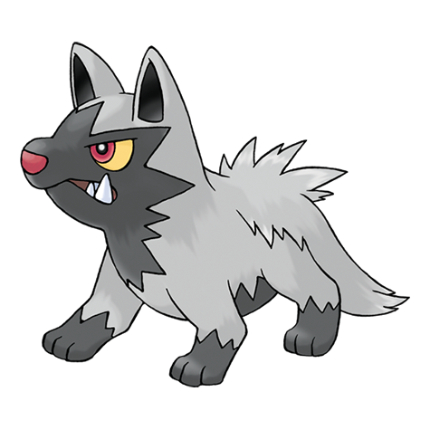

# Poochyena (#0261)

*Bite Pokemon*

**Type:** Buio
**Abilities:** [[Run Away]], [[Quick Feet]], [[Rattled]] *(Hidden)*
**Base HP:** 3

> Poochyena will bite anything that moves. They will chase people and other Pokemon for dozens of miles without loosing track. This Pokemon is persistent and tenacious. In the wild, they form small hunting packs.

---

## Statistiche (Attributes & Limits)

| Attribute | Base / Limit |
|---|---|
| **Strength** | 2/4 |
| **Dexterity** | 2/4 |
| **Vitality** | 1/3 |
| **Special** | 1/3 |
| **Insight** | 1/3 |

---

## Mosse (Learnset)

- **Starter:** [[Tackle|Tackle]], [[Howl|Howl]]
- **Beginner:** [[Sand_Attack|Sand Attack]], [[Bite|Bite]]
- **Amateur:** [[Odor_Sleuth|Odor Sleuth]], [[Roar|Roar]], [[Swagger|Swagger]], [[Assurance|Assurance]], [[Scary_Face|Scary Face]], [[Taunt|Taunt]], [[Take_Down|Take Down]]
- **Ace:** [[Embargo|Embargo]], [[Play_Rough|Play Rough]], [[Sucker_Punch|Sucker Punch]], [[Crunch|Crunch]]
- **Pro:** [[Dig|Dig]], [[Iron_Tail|Iron Tail]], [[Endure|Endure]]

---

## Correlati

### Catena Evolutiva
- [[0261_Poochyena|Poochyena]]
- [[0262_Mightyena|Mightyena]]
