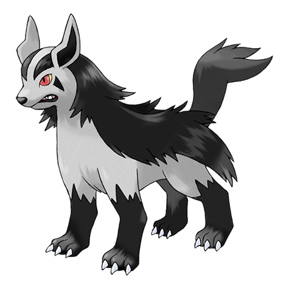

# Mightyena (#0262)

*Bite Pokemon*

**Type:** Buio
**Abilities:** [[Intimidate]], [[Quick Feet]], [[Moxie]] *(Hidden)*
**Base HP:** 4

> They attack savagely, travel in packs and hunt in groups. They will only obey trainers that show superior skills, which they recognize as the alpha leader. They are extremely obedient once they find a master.

---

## Statistiche (Attributes & Limits)

| Attribute | Base / Limit |
|---|---|
| **Strength** | 3/6 |
| **Dexterity** | 2/5 |
| **Vitality** | 2/5 |
| **Special** | 2/4 |
| **Insight** | 2/4 |

---

## Mosse (Learnset)

- **Starter:** [[Howl|Howl]], [[Tackle|Tackle]]
- **Beginner:** [[Bite|Bite]], [[Sand_Attack|Sand Attack]]
- **Amateur:** [[Roar|Roar]], [[Odor_Sleuth|Odor Sleuth]], [[Assurance|Assurance]], [[Swagger|Swagger]], [[Taunt|Taunt]], [[Scary_Face|Scary Face]], [[Fire_Fang|Fire Fang]], [[Yawn|Yawn]], [[Thunder_Fang|Thunder Fang]], [[Take_Down|Take Down]], [[Thief|Thief]], [[Ice_Fang|Ice Fang]]
- **Ace:** [[Embargo|Embargo]], [[Crunch|Crunch]], [[Play_Rough|Play Rough]], [[Snarl|Snarl]], [[Sucker_Punch|Sucker Punch]]
- **Pro:** [[Counter|Counter]], [[Snatch|Snatch]], [[Poison_Fang|Poison Fang]]

---

## Correlati

### Catena Evolutiva
- [[0261_Poochyena|Poochyena]]
- [[0262_Mightyena|Mightyena]]
