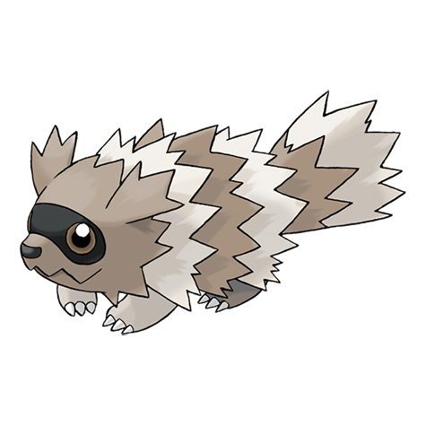

# Zigzagoon (#0263)

*Tiny Raccoon Pokemon*

**Type:** Normale
**Abilities:** [[Pickup]], [[Gluttony]], [[Quick Feet]] *(Hidden)*
**Base HP:** 3

> They are extremely curious and want to know all about everything. Due to their innate curiosity, they usually find hidden objects. Sometimes they play dead to avoid being attacked.

---

## Statistiche (Attributes & Limits)

| Attribute | Base / Limit |
|---|---|
| **Strength** | 1/3 |
| **Dexterity** | 2/4 |
| **Vitality** | 1/3 |
| **Special** | 1/3 |
| **Insight** | 1/3 |

---

## Mosse (Learnset)

- **Starter:** [[Growl|Growl]], [[Tackle|Tackle]]
- **Beginner:** [[Tail_Whip|Tail Whip]], [[Take_Down|Take Down]], [[Baby_Doll_Eyes|Baby-Doll Eyes]]
- **Amateur:** [[Sand_Attack|Sand Attack]], [[Odor_Sleuth|Odor Sleuth]], [[Mud_Sport|Mud Sport]], [[Pin_Missile|Pin Missile]], [[Covet|Covet]], [[Headbutt|Headbutt]], [[Bestow|Bestow]]
- **Ace:** [[Flail|Flail]], [[Rest|Rest]], [[Belly_Drum|Belly Drum]], [[Fling|Fling]]
- **Pro:** [[Helping_Hand|Helping Hand]], [[Seed_Bomb|Seed Bomb]], [[Trick|Trick]]

---

## Correlati

### Catena Evolutiva
- [[0263_Zigzagoon|Zigzagoon]]
- [[0264_Linoone|Linoone]]
