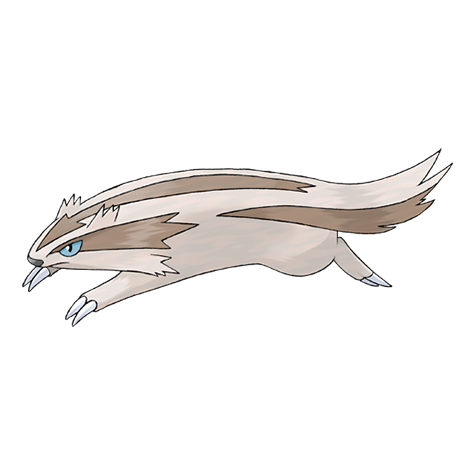

# Linoone (#0264)

*Rushing Pokemon*

**Type:** Normale
**Abilities:** [[Pickup]], [[Gluttony]], [[Quick Feet]] *(Hidden)*
**Base HP:** 4

> Linoones are always running at full speed, but they can only do so in straight lines. They find it very difficult to deal with a curved road. They excel at hunting but tend to eat a lot to recover from their tiring runs.

---

## Statistiche (Attributes & Limits)

| Attribute | Base / Limit |
|---|---|
| **Strength** | 2/5 |
| **Dexterity** | 3/6 |
| **Vitality** | 2/4 |
| **Special** | 2/4 |
| **Insight** | 2/4 |

---

## Mosse (Learnset)

- **Starter:** [[Growl|Growl]], [[Tackle|Tackle]]
- **Beginner:** [[Switcheroo|Switcheroo]], [[Sand_Attack|Sand Attack]], [[Tail_Whip|Tail Whip]]
- **Amateur:** [[Headbutt|Headbutt]], [[Play_Rough|Play Rough]], [[Rototiller|Rototiller]], [[Odor_Sleuth|Odor Sleuth]], [[Mud_Sport|Mud Sport]], [[Fury_Swipes|Fury Swipes]], [[Covet|Covet]], [[Bestow|Bestow]]
- **Ace:** [[Double_Edge|Double-Edge]], [[Slash|Slash]], [[Rest|Rest]], [[Belly_Drum|Belly Drum]], [[Fling|Fling]]
- **Pro:** [[Extreme_Speed|Extreme Speed]], [[Super_Fang|Super Fang]], [[Seed_Bomb|Seed Bomb]]

---

## Correlati

### Catena Evolutiva
- [[0263_Zigzagoon|Zigzagoon]]
- [[0264_Linoone|Linoone]]
