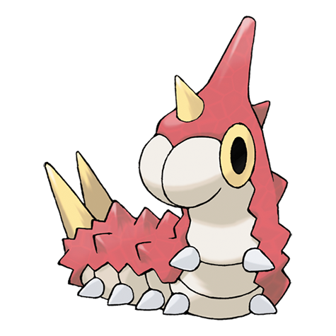

# Wurmple (#0265)

*Worm Pokemon*

**Type:** Insetto
**Abilities:** [[Shield Dust]], [[Run Away]] *(Hidden)*
**Base HP:** 3

> It uses the spikes on its rear to peel the trees and feed on their sap. Their feet have suction pads to climb easily. Wurmples are plentiful and live in forests, but they are often attacked by bird Pokemon.

---

## Statistiche (Attributes & Limits)

| Attribute | Base / Limit |
|---|---|
| **Strength** | 2/4 |
| **Dexterity** | 1/3 |
| **Vitality** | 1/3 |
| **Special** | 1/3 |
| **Insight** | 1/3 |

---

## Mosse (Learnset)

- **Starter:** [[String_Shot|String Shot]], [[Tackle|Tackle]]
- **Beginner:** [[Poison_Sting|Poison Sting]]
- **Amateur:** [[Bug_Bite|Bug Bite]]
- **Pro:** [[Electroweb|Electroweb]], [[Snore|Snore]]

---

## Correlati

### Catena Evolutiva
- [[0265_Wurmple|Wurmple]]
- [[0266_Silcoon|Silcoon]]
- [[0267_Beautifly|Beautifly]]
- [[0268_Cascoon|Cascoon]]
- [[0269_Dustox|Dustox]]
