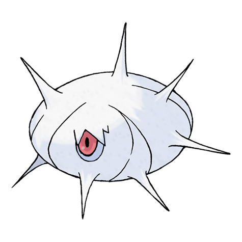

# Silcoon (#0266)

*Cocoon Pokemon*

**Type:** Insetto
**Abilities:** [[Shed Skin]]
**Base HP:** 4

> They tether themselves to tree branches while they wait to evolve. Sometimes they peek from a small hole in the cocoon. Silcoons feed only on raindrops. If Wrumple lived among flowers, it evolves to Silcoon.

---

## Statistiche (Attributes & Limits)

| Attribute | Base / Limit |
|---|---|
| **Strength** | 2/4 |
| **Dexterity** | 1/2 |
| **Vitality** | 2/4 |
| **Special** | 1/3 |
| **Insight** | 1/3 |

---

## Mosse (Learnset)

- **Starter:** [[Harden|Harden]]
- **Amateur:** [[Iron_Defense|Iron Defense]]
- **Pro:** [[Electroweb|Electroweb]]

---

## Correlati

### Catena Evolutiva
- [[0265_Wurmple|Wurmple]]
- [[0266_Silcoon|Silcoon]]
- [[0267_Beautifly|Beautifly]]
- [[0268_Cascoon|Cascoon]]
- [[0269_Dustox|Dustox]]
