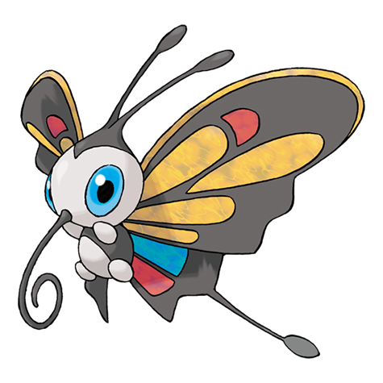

# Beautifly (#0267)

*Butterfly Pokemon*

**Type:** Insetto / Volante
**Abilities:** [[Swarm]], [[Rivalry]] *(Hidden)*
**Base HP:** 5

> They can’t resist the pollen of flowers, if you leave one in the window, a Beautifly is sure to come. Despite their appearance, they are aggressive, they drain living creatures of their fluids just as they do with flowers.

---

## Statistiche (Attributes & Limits)

| Attribute | Base / Limit |
|---|---|
| **Strength** | 2/5 |
| **Dexterity** | 2/4 |
| **Vitality** | 2/4 |
| **Special** | 3/6 |
| **Insight** | 2/4 |

---

## Mosse (Learnset)

- **Starter:** [[Absorb|Absorb]]
- **Beginner:** [[Gust|Gust]]
- **Amateur:** [[Stun_Spore|Stun Spore]], [[Morning_Sun|Morning Sun]], [[Air_Cutter|Air Cutter]], [[Mega_Drain|Mega Drain]], [[Whirlwind|Whirlwind]], [[Attract|Attract]], [[Silver_Wind|Silver Wind]], [[Rage|Rage]]
- **Ace:** [[Giga_Drain|Giga Drain]], [[Bug_Buzz|Bug Buzz]], [[Quiver_Dance|Quiver Dance]]
- **Pro:** [[Swift|Swift]], [[Defog|Defog]], [[Captivate|Captivate]]

---

## Correlati

### Catena Evolutiva
- [[0265_Wurmple|Wurmple]]
- [[0266_Silcoon|Silcoon]]
- [[0267_Beautifly|Beautifly]]
- [[0268_Cascoon|Cascoon]]
- [[0269_Dustox|Dustox]]
