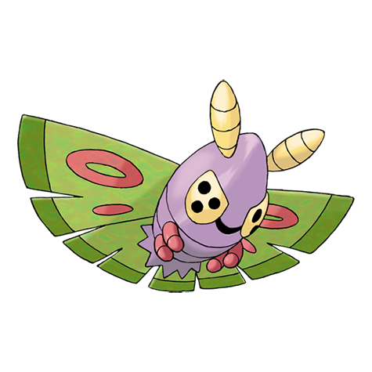

# Dustox (#0269)

*Poison Moth Pokemon*

**Type:** Insetto / Veleno
**Abilities:** [[Shield Dust]], [[Compound Eyes]] *(Hidden)*
**Base HP:** 5

> They travel in big groups during the night, attracted to bright lights and big cities. Their flight releases a poisonous shining dust that causes mayhem in towns. For this reason people dislike them.

---

## Statistiche (Attributes & Limits)

| Attribute | Base / Limit |
|---|---|
| **Strength** | 2/4 |
| **Dexterity** | 2/4 |
| **Vitality** | 3/6 |
| **Special** | 2/4 |
| **Insight** | 2/5 |

---

## Mosse (Learnset)

- **Starter:** [[Confusion|Confusion]]
- **Beginner:** [[Gust|Gust]]
- **Amateur:** [[Protect|Protect]], [[Moonlight|Moonlight]], [[Venoshock|Venoshock]], [[Psybeam|Psybeam]], [[Whirlwind|Whirlwind]], [[Light_Screen|Light Screen]], [[Silver_Wind|Silver Wind]]
- **Ace:** [[Toxic|Toxic]], [[Bug_Buzz|Bug Buzz]], [[Quiver_Dance|Quiver Dance]]
- **Pro:** [[Air_Cutter|Air Cutter]], [[Swift|Swift]], [[Twister|Twister]]

---

## Correlati

### Catena Evolutiva
- [[0265_Wurmple|Wurmple]]
- [[0266_Silcoon|Silcoon]]
- [[0267_Beautifly|Beautifly]]
- [[0268_Cascoon|Cascoon]]
- [[0269_Dustox|Dustox]]
