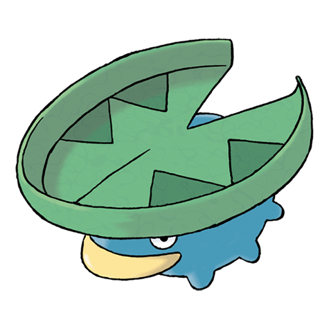

# Lotad (#0270)

*Water Weed Pokemon*

**Type:** Acqua / Erba
**Abilities:** [[Swift Swim]], [[Rain Dish]], [[Own Tempo]] *(Hidden)*
**Base HP:** 3

> They live in ponds and lakes, floating atop the water. The big leaf on their head is known to act as a ferry for smaller Pokemon. The leaf is delicate and needs constant watering or else Lotad will grow sick.

---

## Statistiche (Attributes & Limits)

| Attribute | Base / Limit |
|---|---|
| **Strength** | 1/3 |
| **Dexterity** | 1/3 |
| **Vitality** | 1/3 |
| **Special** | 1/3 |
| **Insight** | 2/4 |

---

## Mosse (Learnset)

- **Starter:** [[Astonish|Astonish]], [[Growl|Growl]]
- **Beginner:** [[Absorb|Absorb]], [[Nature_Power|Nature Power]], [[Bubble|Bubble]]
- **Amateur:** [[Mist|Mist]], [[Natural_Gift|Natural Gift]], [[Mega_Drain|Mega Drain]], [[Bubble_Beam|Bubble Beam]]
- **Ace:** [[Rain_Dance|Rain Dance]], [[Zen_Headbutt|Zen Headbutt]], [[Leech_Seed|Leech Seed]]
- **Pro:** [[Energy_Ball|Energy Ball]], [[Sweet_Scent|Sweet Scent]], [[Flail|Flail]]

---

## Correlati

### Catena Evolutiva
- [[0270_Lotad|Lotad]]
- [[0271_Lombre|Lombre]]
- [[0272_Ludicolo|Ludicolo]]
