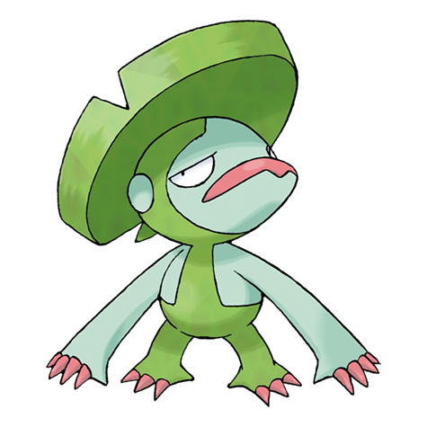

# Lombre (#0271)

*Jolly Pokemon*

**Type:** Acqua / Erba
**Abilities:** [[Swift Swim]], [[Rain Dish]], [[Own Tempo]] *(Hidden)*
**Base HP:** 4

> This nocturnal Pokemon has a mischievous and impish personality. While playing pranks on people, Lombres are commonly mistaken for human children. It enjoys to startle unaware swimmers.

---

## Statistiche (Attributes & Limits)

| Attribute | Base / Limit |
|---|---|
| **Strength** | 2/4 |
| **Dexterity** | 2/4 |
| **Vitality** | 2/4 |
| **Special** | 2/4 |
| **Insight** | 2/5 |

---

## Mosse (Learnset)

- **Starter:** [[Astonish|Astonish]], [[Growl|Growl]]
- **Beginner:** [[Absorb|Absorb]], [[Nature_Power|Nature Power]], [[Bubble|Bubble]]
- **Amateur:** [[Fake_Out|Fake Out]], [[Fury_Swipes|Fury Swipes]], [[Water_Sport|Water Sport]], [[Bubble_Beam|Bubble Beam]], [[Zen_Headbutt|Zen Headbutt]]
- **Ace:** [[Knock_Off|Knock Off]], [[Uproar|Uproar]], [[Hydro_Pump|Hydro Pump]]
- **Pro:** [[Ice_Punch|Ice Punch]], [[Fire_Punch|Fire Punch]], [[Thunder_Punch|Thunder Punch]]

---

## Correlati

### Catena Evolutiva
- [[0270_Lotad|Lotad]]
- [[0271_Lombre|Lombre]]
- [[0272_Ludicolo|Ludicolo]]
