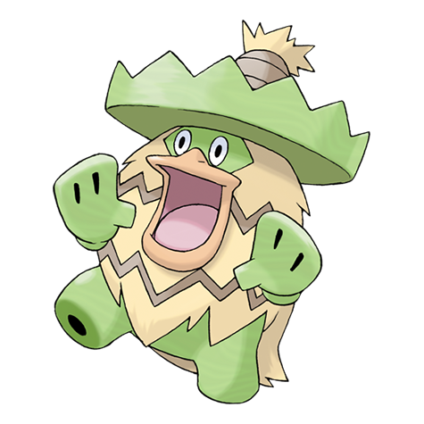

# Ludicolo (#0272)

*Carefree Pokemon*

**Type:** Acqua / Erba
**Abilities:** [[Swift Swim]], [[Rain Dish]], [[Own Tempo]] *(Hidden)*
**Base HP:** 5

> Ludicolo starts dancing at the sound of music. Pokemon and people will dance as well. They are said to appear when children sing. They love festive places and parties.

---

## Statistiche (Attributes & Limits)

| Attribute | Base / Limit |
|---|---|
| **Strength** | 2/5 |
| **Dexterity** | 2/5 |
| **Vitality** | 2/5 |
| **Special** | 2/5 |
| **Insight** | 3/6 |

---

## Mosse (Learnset)

- **Starter:** [[Astonish|Astonish]], [[Growl|Growl]]
- **Amateur:** [[Mega_Drain|Mega Drain]]
- **Ace:** [[Nature_Power|Nature Power]]
- **Pro:** [[Teeter_Dance|Teeter Dance]], [[Giga_Drain|Giga Drain]], [[Entrainment|Entrainment]]

---

## Correlati

### Catena Evolutiva
- [[0270_Lotad|Lotad]]
- [[0271_Lombre|Lombre]]
- [[0272_Ludicolo|Ludicolo]]
