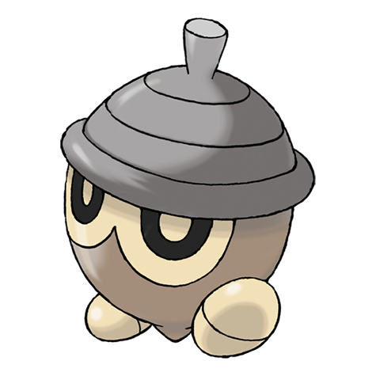

# Seedot (#0273)

*Acorn Pokemon*

**Type:** Erba
**Abilities:** [[Chlorophyll]], [[Early Bird]], [[Pickpocket]] *(Hidden)*
**Base HP:** 3

> They attach to tree branches to suck moisture from them. While immobile, the young are identical to real acorns. They enjoy scaring other Pokemon, especially Pidgeys. If they fall they are at risk of being eaten.

---

## Statistiche (Attributes & Limits)

| Attribute | Base / Limit |
|---|---|
| **Strength** | 1/3 |
| **Dexterity** | 1/3 |
| **Vitality** | 2/4 |
| **Special** | 1/3 |
| **Insight** | 1/3 |

---

## Mosse (Learnset)

- **Starter:** [[Bide|Bide]]
- **Beginner:** [[Harden|Harden]], [[Growth|Growth]]
- **Amateur:** [[Nature_Power|Nature Power]], [[Synthesis|Synthesis]]
- **Ace:** [[Sunny_Day|Sunny Day]], [[Explosion|Explosion]]
- **Pro:** [[Bullet_Seed|Bullet Seed]], [[Grassy_Terrain|Grassy Terrain]], [[Worry_Seed|Worry Seed]]

---

## Correlati

### Catena Evolutiva
- [[0273_Seedot|Seedot]]
- [[0274_Nuzleaf|Nuzleaf]]
- [[0275_Shiftry|Shiftry]]
