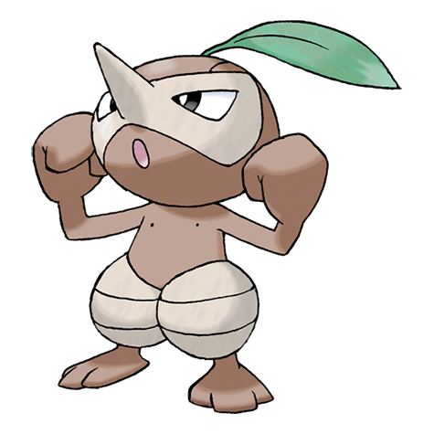

# Nuzleaf (#0274)

*Wily Pokemon*

**Type:** Erba / Buio
**Abilities:** [[Chlorophyll]], [[Early Bird]], [[Pickpocket]] *(Hidden)*
**Base HP:** 4

> They live inside holes on big trees. Their leaves are played like flutes to strike fear and discomfort in lost people’s hearts. They like to go out and startle people. Their noses are really sensitive and frail.

---

## Statistiche (Attributes & Limits)

| Attribute | Base / Limit |
|---|---|
| **Strength** | 2/5 |
| **Dexterity** | 2/4 |
| **Vitality** | 2/4 |
| **Special** | 2/4 |
| **Insight** | 1/3 |

---

## Mosse (Learnset)

- **Starter:** [[Pound|Pound]], [[Growth|Growth]]
- **Beginner:** [[Harden|Harden]]
- **Amateur:** [[Razor_Leaf|Razor Leaf]], [[Nature_Power|Nature Power]], [[Fake_Out|Fake Out]], [[Torment|Torment]], [[Leaf_Blade|Leaf Blade]], [[Feint_Attack|Feint Attack]]
- **Ace:** [[Razor_Wind|Razor Wind]], [[Swagger|Swagger]], [[Extrasensory|Extrasensory]]
- **Pro:** [[Bullet_Seed|Bullet Seed]], [[Leech_Seed|Leech Seed]], [[Foul_Play|Foul Play]]

---

## Correlati

### Catena Evolutiva
- [[0273_Seedot|Seedot]]
- [[0274_Nuzleaf|Nuzleaf]]
- [[0275_Shiftry|Shiftry]]
